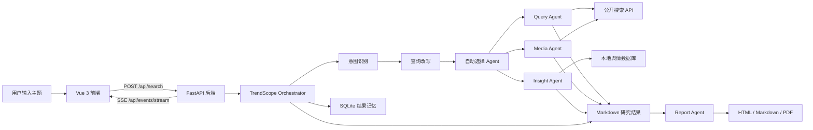

# SentinelAI Multi-Agent

基于 FastAPI、LangGraph 和 Vue 3 的多 Agent 舆情研判与报告生成平台。项目面向热点事件追踪、公开信息聚合、本地舆情库分析、视频平台传播趋势研判和长报告生成等场景，核心入口是 `TrendScope`：用户只需要输入人物、地点、事件、品牌或主题，系统会自动识别意图、改写查询、选择参与 Agent，并把结果以实时进度和 Markdown/HTML/PDF 报告形式输出。

## 目录

- [项目特性](#项目特性)
- [系统架构](#系统架构)
- [Agent 分工](#agent-分工)
- [目录结构](#目录结构)
- [环境要求](#环境要求)
- [快速开始](#快速开始)
- [配置说明](#配置说明)
- [运行方式](#运行方式)
- [API 说明](#api-说明)
- [数据与产物](#数据与产物)
- [测试](#测试)
- [开发说明](#开发说明)
- [常见问题](#常见问题)

## 项目特性

- `TrendScope` 自动编排：自动识别查询意图、改写查询、选择 `Query`、`Media`、`Insight` 等 Agent。
- 多源公开搜索聚合：支持 Tavily、Anspire、Bocha 等公开搜索接口，不接入登录爬虫，不绕过验证码或平台风控。
- 本地结果记忆：TrendScope 会把热点洞察结果写入本地 SQLite，下次相似查询命中缓存后仍会执行时效复核。
- 事件时间线：针对“最近发生了什么”“事件始末”“时间线”等意图自动整理关键时间节点。
- 可信来源评分：按官方来源、权威媒体、学术来源、视频/社交平台和普通来源做轻量评级。
- 舆情风险辅助：可选启用风险分析、争议点识别、网友观点摘要和后续关注点提示。
- LangGraph 工作流：`QueryEngine`、`MediaEngine`、`InsightEngine`、`ReportEngine` 均采用节点化工作流组织。
- 实时前端反馈：后端通过 SSE 推送各 Engine 的进度、结果、错误和 Forum 消息。
- 长报告生成：Report Agent 支持基于各 Engine 输出生成 HTML 报告，并导出 Markdown / PDF。
- 前后端一体部署：开发环境可分别启动，生产/演示环境可通过 Docker Compose 一键启动。

## 系统架构



后端入口是 [main.py](./main.py)，实际 FastAPI 应用定义在 [app/main.py](./app/main.py)。前端位于 [frontend](./frontend)，构建产物会输出到 `frontend/dist`，后端会在存在构建产物时直接托管 Vue SPA。

## Agent 分工

| Agent | 位置 | 主要职责 | 典型输出 |
| --- | --- | --- | --- |
| TrendScope Agent | `app/services/trendscope_service.py` | 统一入口、意图识别、查询改写、自动选择 Agent、本地结果记忆、时效复核、总览报告 | 热点概览、时间线、可信来源、风险等级 |
| Query Agent | `engines/QueryEngine` | 公开搜索、事实核查、可信来源聚合、事件时间线辅助 | 面向事实核查的研究小结与引用 |
| Media Agent | `engines/MediaEngine` | 视频平台热点、社交传播趋势、内容爆点和平台信号分析 | 平台传播研判与内容信号 |
| Insight Agent | `engines/InsightEngine` | 本地舆情库查询、情感分析、聚类、风险分析 | 本地数据洞察、情绪与聚类结果 |
| Report Agent | `engines/ReportEngine` | 长报告生成、模板拆分、章节生成、HTML/PDF 渲染 | HTML 报告、Markdown、PDF |
| Forum Host | `engines/ForumEngine` | 汇总多个 Agent 的讨论内容，可选作为主持人输出 | 多 Agent 对话与总结 |

## 目录结构

```text
.
├── app/                         # FastAPI 应用、路由、服务层
│   ├── main.py                  # FastAPI app、路由注册、SPA 静态托管
│   ├── config.py                # pydantic-settings 配置入口，读取根目录 .env
│   ├── routers/                 # API 路由
│   └── services/                # TrendScope、搜索、报告、系统配置等服务
├── engines/                     # LangGraph Agent 工作流
│   ├── QueryEngine/
│   ├── MediaEngine/
│   ├── InsightEngine/
│   ├── ReportEngine/
│   ├── ForumEngine/
│   └── common/                  # 共享 LLM 客户端、结构化输出工具
├── frontend/                    # Vue 3 + TypeScript + Vite 前端
│   ├── src/api/                 # 后端 API 封装
│   ├── src/stores/              # Pinia 状态管理
│   ├── src/views/               # TrendScope、Insight、Media、Query、Forum、Report 视图
│   └── vite.config.ts           # 开发代理到 127.0.0.1:5000
├── tools/                       # SentinelSpider 与情感分析/主题识别模型工具
├── tests/                       # 后端和工具链测试
├── data/                        # 运行时数据和报告产物，默认本地生成
├── logs/                        # Engine 日志，默认本地生成
├── docker-compose.yaml          # MySQL + Backend + Frontend
├── Dockerfile.backend
├── Dockerfile.frontend
├── requirements.txt             # 后端依赖
└── main.py                      # 本地启动入口
```

## 环境要求

推荐版本：

- Python 3.11+
- Node.js 20+
- npm 10+
- Docker Desktop，可选
- MySQL 8 或 PostgreSQL，可选；如果只跑公开搜索和 TrendScope 轻量流程，可以先不接本地舆情库

本地 PDF 导出依赖 WeasyPrint 及 Pango/Cairo 等系统库。Docker 后端镜像已经安装对应运行时依赖；如果在 Windows 本机直接导出 PDF，需要额外准备 WeasyPrint 的系统依赖。

## 快速开始

### 1. 克隆并进入项目

```powershell
cd E:\SentinelAI-MultiAgent
```

### 2. 创建后端虚拟环境

```powershell
python -m venv .venv
.\.venv\Scripts\Activate.ps1
python -m pip install --upgrade pip
python -m pip install -r requirements.txt
```

### 3. 准备配置文件

```powershell
Copy-Item .env.example .env
```

然后编辑根目录 `.env`，至少配置一个 LLM Agent 密钥和一个公开搜索密钥。开发阶段最常用的是：

```env
QUERY_ENGINE_API_KEY=
QUERY_ENGINE_BASE_URL=https://api.deepseek.com
QUERY_ENGINE_MODEL_NAME=deepseek-chat

MEDIA_ENGINE_API_KEY=
MEDIA_ENGINE_BASE_URL=https://aihubmix.com/v1
MEDIA_ENGINE_MODEL_NAME=gemini-2.5-pro

INSIGHT_ENGINE_API_KEY=
INSIGHT_ENGINE_BASE_URL=https://api.moonshot.cn/v1
INSIGHT_ENGINE_MODEL_NAME=kimi-k2-0711-preview

SEARCH_TOOL_TYPE=TavilyAPI
TAVILY_API_KEY=
```

如果缺少公开搜索密钥，系统不会崩溃，会使用空搜索适配器返回空结果，但报告内容会明显不足。

### 4. 启动后端

```powershell
python main.py
```

默认监听：

- 后端接口：http://127.0.0.1:5000
- API 文档：http://127.0.0.1:5000/docs

### 5. 启动前端

另开一个 PowerShell：

```powershell
cd frontend
npm install
npm run dev
```

默认访问：

- 前端开发服务：http://127.0.0.1:5173

Vite 会把 `/api` 和 `/static` 请求代理到 `http://127.0.0.1:5000`。

## 配置说明

所有密钥和可变配置都应写入根目录 `.env`，不要写死到 `app/config.py` 或业务代码中。前端“LLM 配置”弹窗也会读写根目录 `.env`。

### 服务配置

| 变量 | 默认值 | 说明 |
| --- | --- | --- |
| `HOST` | `0.0.0.0` | 后端监听地址 |
| `PORT` | `5000` | 后端端口 |
| `FRONTEND_PORT` | `5173` | 前端开发端口或 Docker 前端映射端口 |
| `DB_EXPOSE_PORT` | `3307` | Docker MySQL 暴露端口 |
| `LOG_LEVEL` | `INFO` | 日志等级 |

### 数据库配置

| 变量 | 说明 |
| --- | --- |
| `DB_DIALECT` | 数据库类型，支持 `mysql` 或 `postgresql` |
| `DB_HOST` / `DB_PORT` | 数据库地址和端口 |
| `DB_USER` / `DB_PASSWORD` | 数据库账号和密码 |
| `DB_NAME` | 数据库名，Docker 默认是 `media_crawler` |
| `DB_CHARSET` | 字符集，推荐 `utf8mb4` |
| `DATABASE_URL` | 可选完整连接串，部分工具会优先读取 |

### LLM 配置

| Agent | API Key | Base URL | Model |
| --- | --- | --- | --- |
| Insight Agent | `INSIGHT_ENGINE_API_KEY` | `INSIGHT_ENGINE_BASE_URL` | `INSIGHT_ENGINE_MODEL_NAME` |
| Media Agent | `MEDIA_ENGINE_API_KEY` | `MEDIA_ENGINE_BASE_URL` | `MEDIA_ENGINE_MODEL_NAME` |
| Query Agent | `QUERY_ENGINE_API_KEY` | `QUERY_ENGINE_BASE_URL` | `QUERY_ENGINE_MODEL_NAME` |
| Report Agent | `REPORT_ENGINE_API_KEY` | `REPORT_ENGINE_BASE_URL` | `REPORT_ENGINE_MODEL_NAME` |
| Forum Host | `FORUM_HOST_API_KEY` | `FORUM_HOST_BASE_URL` | `FORUM_HOST_MODEL_NAME` |
| Keyword Optimizer | `KEYWORD_OPTIMIZER_API_KEY` | `KEYWORD_OPTIMIZER_BASE_URL` | `KEYWORD_OPTIMIZER_MODEL_NAME` |

关键词优化器没有配置时，Insight Agent 和 TrendScope 会回退为原始查询或规则改写，不会中断整个分析任务。

### 搜索配置

| 变量 | 说明 |
| --- | --- |
| `SEARCH_TOOL_TYPE` | 可选 `TavilyAPI`、`AnspireAPI`、`BochaAPI` |
| `TAVILY_API_KEY` | Tavily 搜索密钥 |
| `ANSPIRE_BASE_URL` / `ANSPIRE_API_KEY` | Anspire 搜索配置 |
| `BOCHA_BASE_URL` / `BOCHA_WEB_SEARCH_API_KEY` / `BOCHA_API_KEY` | Bocha 搜索配置 |

TrendScope v1 只使用公开搜索聚合，不做登录态采集，不处理验证码，不绕过平台风控。

### Insight 本地模型配置

| 变量 | 默认值 | 说明 |
| --- | --- | --- |
| `SENTIMENT_ANALYSIS_ENABLED` | `True` | 是否启用情感分析 |
| `ENABLE_SENTIMENT_PER_SEARCH` | `True` | 每次搜索是否默认执行情感分析 |
| `SENTIMENT_MODEL_NAME` | `tabularisai/multilingual-sentiment-analysis` | 情感分析模型名或本地路径 |
| `ENABLE_CLUSTERING` | `True` | 是否启用聚类 |
| `CLUSTERING_MODEL_NAME` | `paraphrase-multilingual-MiniLM-L12-v2` | 聚类嵌入模型名或本地路径 |

首次使用 HuggingFace 模型名时可能下载较大的模型文件。如果只是开发 UI 或公开搜索流程，可以先关闭情感分析和聚类。

## 运行方式

### 后端开发模式

```powershell
python main.py
```

### 前端开发模式

```powershell
cd frontend
npm run dev
```

### 前端构建并由后端托管

```powershell
cd frontend
npm run build
cd ..
python main.py
```

构建成功后，FastAPI 会从 `frontend/dist` 提供 SPA 页面。此时访问 `http://127.0.0.1:5000` 即可打开前端页面。

### Docker Compose

```powershell
Copy-Item .env.example .env
docker compose up --build
```

Compose 会启动：

| 服务 | 容器 | 说明 |
| --- | --- | --- |
| `db` | `sentinelai-db` | MySQL 8，默认数据库 `media_crawler` |
| `backend` | `sentinelai-backend` | FastAPI 后端，容器内端口 `5000` |
| `frontend` | `sentinelai-frontend` | Nginx 托管 Vue 构建产物，容器内端口 `80` |

访问地址取决于 `.env`：

- 后端：http://127.0.0.1:${PORT:-5000}
- 前端：http://127.0.0.1:${FRONTEND_PORT:-80}

如果直接复制 `.env.example`，`FRONTEND_PORT=5173`，因此 Docker 前端默认会映射到 `http://127.0.0.1:5173`。

停止服务：

```powershell
docker compose down
```

同时删除数据库和日志卷：

```powershell
docker compose down -v
```

## API 说明

后端接口统一由 FastAPI 提供，启动后可以查看 Swagger 文档：

```text
http://127.0.0.1:5000/docs
```

### Search / TrendScope

#### POST `/api/search`

提交一次自动编排分析任务。后端会立即返回已启动信息，具体进度和结果通过 SSE 推送。

请求体：

```json
{
  "query": "某品牌最近舆情",
  "options": {
    "enable_network_search": true,
    "enable_video_hotspots": true,
    "enable_local_knowledge": true,
    "enable_risk_analysis": false,
    "enable_deep_report": false,
    "search_enhancement_mode": "off"
  }
}
```

`search_enhancement_mode` 可选：

- `off`：关闭增强，只做基础降噪和原始查询。
- `light`：轻量规则改写，适合普通热点追踪。
- `full`：完整增强，会尝试关键词优化器并生成更多搜索查询。

响应示例：

```json
{
  "success": true,
  "message": "auto-selected agents started",
  "query": "某品牌最近舆情",
  "selected_agents": ["trendscope", "query", "media"],
  "intent": {}
}
```

#### GET `/api/search/latest`

读取 `data/report/{trendscope,insight,media,query}` 下最近一次持久化结果，供前端刷新后恢复展示。

### SSE 事件

#### GET `/api/events/stream`

前端通过 EventSource 订阅该接口。主要事件类型包括：

- `engine_progress`：Agent 进度。
- `engine_result`：Agent 最终结果。
- `engine_error`：Agent 异常。
- `forum_message`：Forum 消息。
- `status_update`：状态变更。

### Report

#### GET `/api/report/status`

检查 Report Engine 是否可用，以及生成报告所需输入文件是否准备就绪。

#### POST `/api/report/generate`

基于已有 Engine 输出启动长报告生成。

请求体：

```json
{
  "query": "智能舆情分析报告",
  "custom_template": ""
}
```

#### GET `/api/report/result/{task_id}`

返回已完成任务的 HTML 报告。

#### GET `/api/report/download/{task_id}`

下载已完成任务的 HTML 报告文件。

#### GET `/api/report/export/md/{task_id}`

导出 Markdown。

#### GET `/api/report/export/pdf/{task_id}?optimize=true`

导出 PDF。该接口依赖 Pango/Cairo/WeasyPrint。

### Config

#### GET `/api/config`

读取 `.env` 中支持的配置项。

#### POST `/api/config`

写入允许更新的配置项。该接口会更新根目录 `.env`，并触发后端重新加载配置。

### Forum

#### GET `/api/forum/start`

启动 Forum Engine。

#### GET `/api/forum/stop`

停止 Forum Engine。

#### GET `/api/forum/log`

读取 Forum 消息日志。

### System

#### GET `/api/status`

兼容前端的应用状态接口。

#### GET `/api/system/status`

返回后端系统状态。

## 数据与产物

运行时默认会生成以下目录：

| 路径 | 说明 |
| --- | --- |
| `data/trendscope/trendscope_memory.sqlite3` | TrendScope 本地结果记忆库 |
| `data/report/trendscope` | TrendScope Markdown 和状态 JSON |
| `data/report/query` | Query Agent 输出 |
| `data/report/media` | Media Agent 输出 |
| `data/report/insight` | Insight Agent 输出 |
| `data/report` | Report Agent 长报告产物 |
| `logs` | 各 Engine 运行日志 |

Docker 模式下，`data` 和 `logs` 会映射到命名卷 `app_data`、`app_logs`，MySQL 数据写入 `mysql_data`。

## 测试

运行全部后端测试：

```powershell
pytest
```

重点测试：

```powershell
pytest tests/test_trendscope_service.py tests/test_app_services.py tests/test_query_engine_e2e.py tests/test_media_engine_e2e.py
```

前端构建检查：

```powershell
cd frontend
npm run build
```

部分测试会依赖网络、数据库或外部模型配置。`pytest.ini` 中使用 `integration` 标记区分真实外部服务集成测试。

## 开发说明

### 后端开发

- 新增 API 路由放在 `app/routers`，并在 `app/main.py` 注册。
- 业务编排优先放在 `app/services`，避免在路由中堆复杂逻辑。
- Agent 工作流放在 `engines/{EngineName}`，保持 `agent.py`、`graph.py`、`nodes/`、`tools/`、`prompts/` 的现有分层。
- 可变配置必须写入 `.env` 或 `app/config.py` 的 `Settings` 字段，不要在业务代码中写死密钥。
- 后台任务当前使用线程启动，并通过 `app/services/event_bus.py` 发布事件到 SSE。

### 前端开发

- API 封装位于 `frontend/src/api`。
- 共享状态位于 `frontend/src/stores`。
- 主页面是 `frontend/src/views/Dashboard.vue`，顶部搜索框在 `frontend/src/components/layout/SearchSection.vue`。
- Agent 面板统一使用 `frontend/src/components/engine/EnginePanel.vue` 展示进度、结果和引用。
- 新增前端配置项时，需要同时更新 `frontend/src/stores/config.ts`、`frontend/src/components/config/ConfigModal.vue` 和后端 `CONFIG_KEYS`。

### TrendScope v1 约束

- 用户不需要手动选择 Agent，由系统根据输入意图和高级选项自动选择。
- 第一版不创建定时任务，不启动长期后台服务。
- 热点/最近事件命中缓存后仍需要做时效复核。
- 视频平台热点只通过公开搜索聚合，不接入登录爬虫、不处理验证码、不绕过风控。
- 缺少关键词优化器配置时，必须回退为原始查询或规则查询，不能中断分析。

## 常见问题

### 1. 搜索结果为空

检查 `.env` 中的 `SEARCH_TOOL_TYPE` 和对应 API Key。未配置密钥时，后端会使用空搜索适配器，任务会完成但没有有效来源。

### 2. Insight Agent 连接不上数据库

检查 `DB_DIALECT`、`DB_HOST`、`DB_PORT`、`DB_USER`、`DB_PASSWORD`、`DB_NAME`。Docker 模式下后端容器连接数据库应使用 `DB_HOST=db`、`DB_PORT=3306`。

### 3. PDF 导出失败

本地环境通常是 Pango/Cairo 或 WeasyPrint 依赖缺失。优先使用 Docker 后端镜像验证；如果必须本地运行，需要按 WeasyPrint 官方要求安装系统依赖。

### 4. 前端请求后端失败

开发模式确认后端在 `127.0.0.1:5000`，前端 Vite 代理才会生效。Docker 模式确认 `FRONTEND_PORT` 和 `PORT` 没有被其他程序占用。

### 5. 首次运行很慢

`torch`、`transformers`、`sentence-transformers` 和情感分析模型体积较大，首次安装或首次下载模型会比较慢。开发 UI 或 TrendScope 公开搜索流程时，可以先关闭情感分析与聚类。

### 6. `.env` 被前端配置弹窗改写

这是预期行为。前端“LLM 配置”弹窗会调用 `/api/config` 写回根目录 `.env`。请不要把真实 `.env` 提交到仓库。

## 安全与合规

- 不提交真实密钥、Cookie、Token 或数据库密码。
- 不实现绕过验证码、绕过风控、攻击、爬取隐私数据或恶意自动化功能。
- 视频和社交平台热点分析只使用公开搜索聚合结果。
- 新增临时脚本或临时文件请放入 `.codex-temp/`，任务完成后清理。

