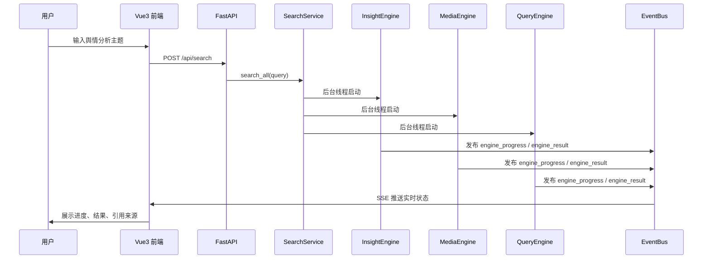
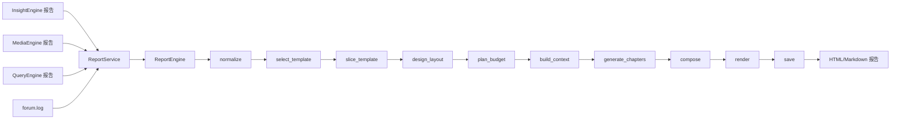

# 尚舆分析平台 —— 项目全景

---

## 1. 项目概述

### 1.1 项目定位与目标

**项目定位：**

尚舆分析平台是一个面向舆情分析、热点研判和专题报告生成的 **多 Agent 智能分析系统**。系统将搜索引擎、私域数据、媒体信息、论坛协作和自动报告生成整合到一条完整链路中，让用户通过一个自然语言问题触发多引擎协同分析。

**核心目标：**

- 将用户的自然语言分析需求转化为多 Agent 协作任务
- 通过 Insight、Media、Query 三类研究引擎并行收集和分析信息
- 使用 ForumEngine 模拟专家讨论，提升研判质量
- 使用 ReportEngine 汇总多源信息，生成结构化舆情分析报告
- 通过 Vue3 前端和 SSE 实时展示任务进度、论坛发言和最终结果

---

### 1.2 核心功能特性

| 功能模块            | 描述                                                           |
| --------------- | ------------------------------------------------------------ |
| **多引擎并行搜索**     | 同时启动 InsightEngine、MediaEngine、QueryEngine，覆盖私域数据、媒体内容和互联网信息 |
| **Agent 研究工作流** | 每个引擎内部使用 LangGraph 组织搜索、总结、反思、再搜索、报告格式化流程                    |
| **事件驱动通信**      | 后端通过 EventBus 发布进度、结果、错误、论坛消息等事件                             |
| **SSE 实时推送**    | 前端通过 SSE 连接实时接收引擎状态和论坛发言                                     |
| **论坛协作机制**      | ForumEngine 监听各引擎摘要，触发主持人模型生成讨论意见                            |
| **自动报告生成**      | ReportEngine 汇总三引擎报告和论坛日志，生成 HTML/Markdown 报告                |
| **容器化部署**       | 使用 Docker Compose 编排 MySQL、后端、前端服务                           |

---

### 1.3 适用场景

- **热点事件分析**：对突发新闻、社会事件、品牌危机进行快速研判
- **品牌舆情监控**：分析品牌声量、用户情绪、传播路径和风险点
- **竞品与行业研究**：围绕行业趋势、竞品动态、用户反馈生成研究报告
- **政企舆情处置**：辅助形成事件脉络、公众关注点和应对建议
- **教学与项目实训**：作为多 Agent、LangGraph、FastAPI、Vue3、SSE 的综合项目案例

---

## 2. 课程目标

### 2.1 主要目标

| 目标                      | 说明                                  |
| ----------------------- | ----------------------------------- |
| **多Agent架构设计**          | 理解编排者-工作者模式，掌握Agent角色定义、工具设计、通信协议   |
| **Harness Engineering** | 掌握编排层的设计：Agent间如何通信、流程如何控制          |
| **舆情分析专项**              | 理解舆情分析这一特定场景下，Agent需要哪些能力、工具和Prompt |

### 2.2 次要目标

| 目标             | 说明                     |
| -------------- | ---------------------- |
| **VibeCoding** | 掌握用AI辅助编程加速项目开发的方法     |
| **项目部署**       | 掌握服务器选型、资源配置、Docker化部署 |

---

## 3. 项目演示

### 3.1 修改配置文件

复制.env.example到.env，修改数据库连接信息、LLM API Key，以及搜索工具的API Key等配置项。

### 3.2 初始化数据库与执行爬虫

InsightEngine 依赖本地舆情数据库。演示前需要先初始化 SentinelSpider 扩展表，再准备热点新闻与平台舆情数据。

#### 3.2.1 初始化数据库表

首先连接到MySQL，执行如下命令，创建数据库：

```bash
create database media_crawler
```

在项目根目录下，执行如下命令，创建爬虫虚拟环境，并激活，创建依赖：

```bash
uv venv spider_venv --python 3.12
source spider_venv/bin/activate
uv pip install -r requirements-spider.txt
```

在项目根目录下执行：

```bash
python tools/SentinelSpider/main.py --init-db
```

该命令会创建两类表：

- **SentinelSpider 扩展表**：`daily_news`、`daily_topics`、`topic_news_relation`、`crawling_tasks`
- **MediaCrawler 平台表**：`douyin_aweme`、`weibo_note`、`xhs_note`、`zhihu_content` 及对应评论表等

其中 `daily_news` 和 `daily_topics` 用于热点新闻与关键词准备，平台表用于 InsightEngine 查询真实舆情内容和评论。

#### 3.2.2 准备热点新闻与话题关键词

执行如下命令：

```bash
python tools/SentinelSpider/main.py --broad-topic
```

该步骤会从热点新闻源抓取当日热榜，写入 `daily_news`，并通过模型提取关键词与摘要，写入 `daily_topics`。如果缺少这一步，InsightEngine 在全局话题搜索时可能会出现 `daily_news` 缺表或无数据的问题。

#### 3.2.3 爬取演示主题的私域舆情数据

直接指定关键词进行爬取，注意，该方式需要二维码登录

```bash
# 在项目根目录下
cd /home/m1881/pycharm_projects/Atguigu_SentinelAI/tools/SentinelSpider/DeepSentimentCrawling/MediaCrawler
python main.py --platform dy --lt qrcode --type search --keywords "浏阳烟花厂爆炸" --save_data_option db
```

完成后，数据会写入平台表，例如 `douyin_aweme` 和 `douyin_aweme_comment`。InsightEngine 启动时会先检查本地平台表是否有数据；后续报告生成过程中会同时查询平台内容表、评论表以及 `daily_news` 热点新闻表。


### 3.3 启动前后端服务

#### 3.3.1 启动后端服务

在项目根目录下执行如下命令，创建虚拟环境（注意：此处会下载torch，所以如果你的某个环境已经有了torch，也可以直接使用，执行过程当中缺什么包，就再单独下载什么包，可以更加节约时间）：

```bash
uv venv project_venv --python 3.12
source project_venv/bin/activate
uv pip install -r requirements.txt
```

接下来，在项目根目录下面，执行如下命令，即可启动后端服务：

```bash
python main.py
```

即可启动后端服务

#### 3.3.2 启动前端服务

进入到前端目录下执行：

```bash
cd /home/m1881/pycharm_projects/Atguigu_SentinelAI/frontend
npm install
npm run dev
```

即可启动前端服务

### 3.4 演示流程："浏阳烟花厂爆炸"

演示流程：

1. 打开前端页面 `http://localhost:5173`
2. 在搜索框输入："分析浏阳烟花厂爆炸事件的舆情走向"
3. 观察系统运行过程：
   - **InsightEngine** 查询私有舆情数据库
   - **MediaEngine** 搜索相关媒体报告，进行传播路径分析
   - **QueryEngine** 搜索权威新闻源，获取最真实事件信息
   - **ForumEngine** Host主持三个Agent进行辩论
   - **ReportEngine** 生成结构化分析报告
4. 查看最终生成的报告（含图表、情感分析、趋势预测）

## 4. 项目整体架构

### 4.1 项目架构图


### 4.2 核心模块说明

| 模块         | 职责                       | 主要目录                                 |
| ---------- | ------------------------ | ------------------------------------ |
| **API 层**  | HTTP 接口、路由注册、SPA 托管、跨域配置 | `app/main.py`、`app/routers/`         |
| **服务层**    | 搜索编排、报告任务、事件总线、系统状态、配置管理 | `app/services/`                      |
| **引擎层**    | 多 Agent 研究、论坛主持、报告生成     | `engines/`                           |
| **前端层**    | 页面展示、状态管理、SSE 订阅、报告预览    | `frontend/src/`                      |
| **数据采集层**  | 舆情爬虫、情感分析模型、外部数据接入       | `tools/`                             |
| **数据与日志层** | 引擎产物、报告文件、系统日志           | `data/`、`logs/`                      |
| **部署层**    | 容器镜像与服务编排                | `Dockerfile.*`、`docker-compose.yaml` |

---

### 4.3 项目目录结构

```text
Atguigu_SentinelAI/
├── app/                         # FastAPI 后端主应用
│   ├── main.py                  # 应用入口、路由注册、SPA 托管
│   ├── config.py                # 全局配置模型
│   ├── routers/                 # API 路由
│   ├── services/                # 业务服务层
│   └── utils/                   # 通用工具
├── engines/                     # 多 Agent 引擎
│   ├── InsightEngine/           # 私域洞察引擎
│   ├── MediaEngine/             # 媒体搜索引擎
│   ├── QueryEngine/             # 网络查询引擎
│   ├── ForumEngine/             # 论坛主持引擎
│   ├── ReportEngine/            # 报告生成引擎
│   └── common/                  # 引擎通用能力
├── frontend/                    # Vue3 前端项目
│   └── src/
│       ├── api/                 # API 请求封装
│       ├── stores/              # 前端状态管理
│       ├── components/          # 页面组件
│       ├── composables/         # SSE、轮询等组合式逻辑
│       └── views/               # 页面视图
├── tools/                       # 爬虫与模型工具
├── tests/                       # 测试用例
├── data/                        # 引擎输出与报告数据
├── logs/                        # 日志文件
├── docker-compose.yaml          # 服务编排
├── Dockerfile.backend           # 后端镜像
├── Dockerfile.frontend          # 前端镜像
└── requirements.txt             # Python 依赖
```

---

## 5. 核心业务流程

### 5.1 用户查询数据流



---

### 5.2 报告生成数据流

生成报告时，会调用服务层的ReportService当中的方法，该方法检查InsightEngine、MediaEngine和QueryEngine的报告，以及ForumEngine所产出的文件，继而经过一系列节点处理，例如模板选择，布局设计等，最终产出报告，并可下载为HTML或者是MarkDown文件


