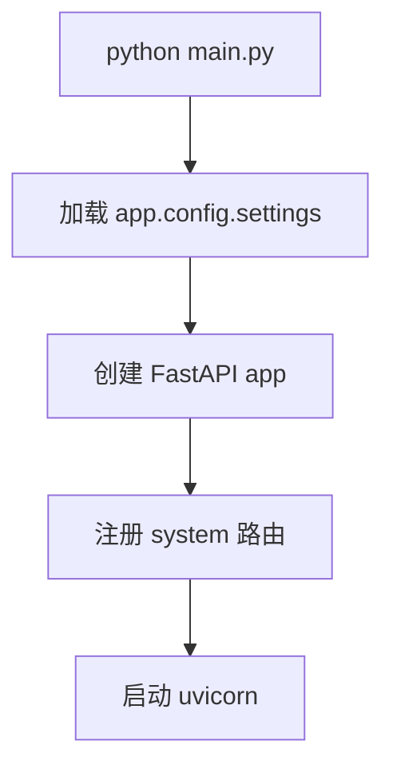
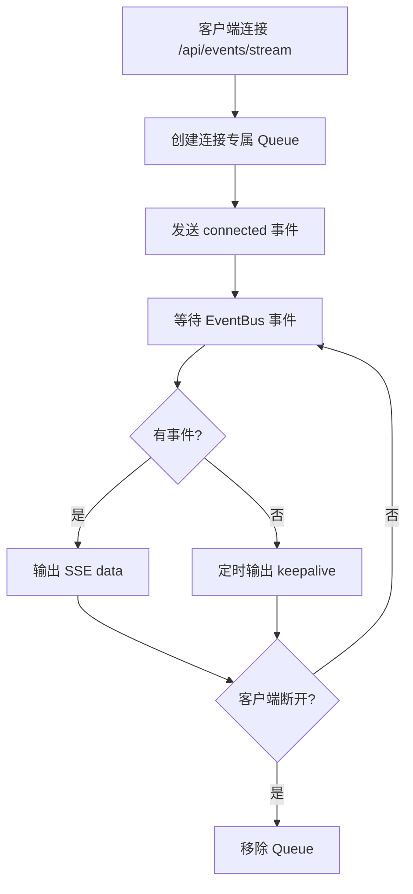
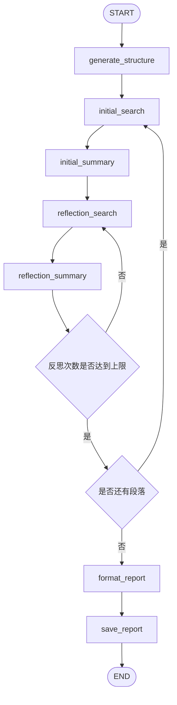
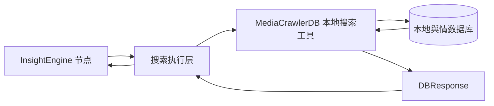
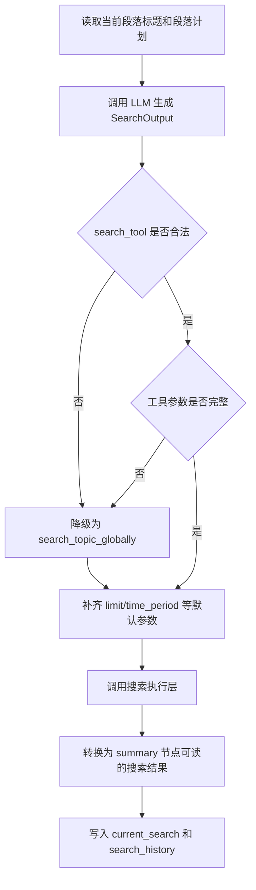
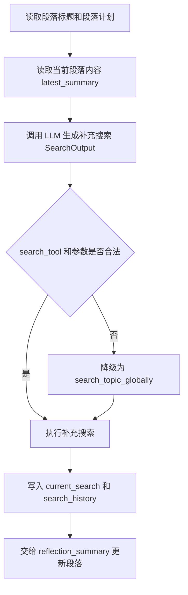
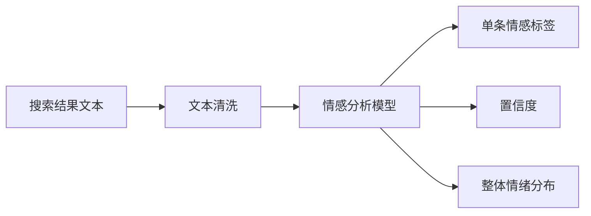
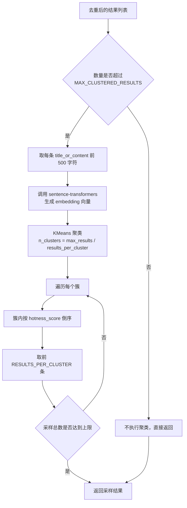

# 尚舆分析平台：项目脚手架与单引擎工作流构建

本文档用于指导项目脚手架与 InsightEngine 单引擎工作流编码，按顺序实现 01-06 六个步骤。


---

## 01. 项目骨架与配置系统

### 1.1 目标

搭建一个能启动、能做健康检查、能读取基础配置的最小后端项目。

### 1.2 需要做的事情

| 序号 | 任务 | 说明 |
| --- | --- | --- |
| 1 | 创建最小后端目录 | 只创建本步骤需要的 `app/`、`routers/system.py`、`services/system_service.py`、`logs/`、`tests/` |
| 2 | 实现基础配置 | 在 `app/config.py` 中定义 `HOST`、`PORT`、`LOG_LEVEL` |
| 3 | 实现 FastAPI 应用 | 在 `app/main.py` 中创建 app、注册 CORS、注册 system 路由 |
| 4 | 实现启动入口 | 在根目录 `main.py` 中启动 uvicorn |
| 5 | 实现健康检查 | 提供 `GET /api/system/status` |
| 6 | 添加基础测试 | 验证 app 可导入、配置可读取、健康检查可访问 |

### 1.3 本步骤结束后的目录

```text
Atguigu_SentinelAI/
├── main.py
├── requirements.txt
├── pytest.ini
├── .env.example
├── app/
│   ├── __init__.py
│   ├── main.py
│   ├── config.py
│   ├── routers/
│   │   ├── __init__.py
│   │   └── system.py
│   └── services/
│       ├── __init__.py
│       └── system_service.py
├── logs/
└── tests/
    ├── __init__.py
    └── test_app_utils.py
```

### 1.4 基础配置

| 配置项 | 类型 | 默认值 | 说明 |
| --- | --- | --- | --- |
| `HOST` | string | `0.0.0.0` | 后端监听地址 |
| `PORT` | int | `5000` | 后端监听端口 |
| `LOG_LEVEL` | string | `INFO` | 日志等级 |

### 1.5 启动流程



图中描述的是第 01 步的最小启动链路：执行 `python main.py` 后，根入口先加载基础配置，然后创建 FastAPI 应用对象。应用只注册 system 路由，最后交给 uvicorn 启动服务。本步骤不包含配置接口、查询接口、事件流、引擎任务等后续能力。

### 1.6 本步骤接口

| 方法 | 路径 | 职责 | 响应 |
| --- | --- | --- | --- |
| GET | `/api/system/status` | 健康检查 | `{"success": true}` |

### 1.7 文件职责

| 文件 | 职责 |
| --- | --- |
| `main.py` | 根启动入口，调用 uvicorn 启动 `app.main:app` |
| `app/main.py` | 创建 FastAPI 应用，注册 CORS 和 system 路由 |
| `app/config.py` | 定义基础 `Settings`，从 `.env` 和环境变量加载配置 |
| `app/routers/system.py` | 定义健康检查接口 |


### 1.8 边界情况

| 场景 | 处理方式 |
| --- | --- |
| `.env` 不存在 | 使用默认配置启动，`.env` 优先级高于系统环境变量 |
| 端口被占用 | uvicorn 启动失败，保留原始错误 |

### 1.9 测试用例设计

| 测试文件 | 测试目标 | Mock/前置条件 | 操作 | 预期结果 |
| --- | --- | --- | --- | --- |
| `tests/test_app_utils.py` | 验证 FastAPI 应用可导入 | 不依赖真实 `.env` | `from app.main import app` | app 对象可正常创建 |
| `tests/test_app_utils.py` | 验证基础配置默认值 | 临时清理 `HOST`、`PORT`、`LOG_LEVEL` 环境变量 | 实例化 `Settings` | 返回默认 `HOST=0.0.0.0`、`PORT=5000`、`LOG_LEVEL=INFO` |
| `tests/test_app_utils.py` | 验证健康检查接口 | 使用 `TestClient(app)` | 请求 `GET /api/system/status` | 状态码 200，响应为 `{"success": true}` |
| `tests/test_app_utils.py` | 验证 `.env` 缺失时仍可启动配置 | 使用临时目录或 monkeypatch 指向不存在的 `.env` | 实例化配置对象 | 不抛异常，使用默认配置 |

---

## 02. 后端 API 脚手架

### 2.1 目标

增加配置接口以及舆情任务查询接口

### 2.2 需要做的事情

| 序号 | 任务 | 说明 |
| --- | --- | --- |
| 1 | 新增配置路由 | 创建 `app/routers/config.py`，提供配置读取和保存接口 |
| 2 | 新增查询路由 | 创建 `app/routers/search.py`，提供查询请求入口 |
| 3 | 新增配置服务 | 创建 `app/services/config_service.py`，封装读取配置和修改配置逻辑 |
| 4 | 新增查询服务 | 创建 `app/services/search_service.py`，本步骤只做参数接收和同步返回 |
| 5 | 注册新增路由 | 在 `app/main.py` 中注册 config 和 search 路由 |
| 6 | 添加接口测试 | 验证配置接口、查询接口的正常响应和异常响应 |

### 2.3 本步骤新增目录与文件

```text
app/
├── routers/
│   ├── config.py
│   └── search.py
└── services/
    ├── config_service.py
    └── search_service.py
```

### 2.4 分层关系


图中描述的是第 02 步的后端分层关系：调用方只访问 router，router 负责 HTTP 请求解析和响应封装；service 负责具体业务逻辑，例如读取配置、修改配置、处理查询请求。config_service需要写具体实现，search_service.py 只做参数接收和空结果返回，不启动任何任务。

### 2.5 本步骤接口

| 方法 | 路径 | 职责 | 请求 | 响应 |
| --- | --- | --- | --- | --- |
| GET | `/api/config` | 读取配置 | 无 | `{"success": true, "config": {...}}` |
| POST | `/api/config` | 保存配置 | 配置 key-value | `{"success": true, "config": {...}}` |
| POST | `/api/search` | 接收查询请求，返回已接收 | `{"query": "..."}` | `{"success": true, "message": "查询已接收", "query": "..."}` |
| GET | `/api/search/latest` | 返回最近查询结果空结构 | 无 | `{"success": true, "results": {}}` |

### 2.6 路由职责

| 文件 | 职责 |
| --- | --- |
| `app/routers/config.py` | 处理配置读取和更新请求 |
| `app/routers/search.py` | 处理查询发起和最近结果读取请求 |

### 2.7 服务职责

| 文件 | 职责 |
| --- | --- |
| `app/services/config_service.py` | 读取加载的配置项，更新配置项 |
| `app/services/search_service.py` | 当前只做参数接收和空结果返回，不启动后台任务 |

### 2.8 配置接口允许字段

| 配置项 | 说明 |
| --- | --- |
| `HOST` | 后端监听地址 |
| `PORT` | 后端监听端口 |
| `LOG_LEVEL` | 日志等级 |

### 2.9 注意事项

| 事项 | 要求 |
| --- | --- |
| 接口边界 | `/api/search` 此时不调用引擎、不发事件、不写文件 |
| 服务边界 | `search_service.py` 此时只返回同步响应 |
| 配置边界 | 只允许更新白名单配置项 |

### 2.10 边界情况

| 场景 | 处理方式 |
| --- | --- |
| POST `/api/search` 请求体不是 JSON | 返回 400 |
| `query` 为空 | 返回 400 |
| POST `/api/config` body 为空 | 返回 400 |
| 配置项不在白名单 | 忽略；如果没有任何有效项，返回 400 |
| `.env` 不存在 | 保存配置时创建 `.env` |

### 2.11 测试用例设计

| 测试文件 | 测试目标 | Mock/前置条件 | 操作 | 预期结果 |
| --- | --- | --- | --- | --- |
| `tests/test_app_services.py` | 验证配置读取接口 | 使用临时 `.env` 或 monkeypatch 配置文件路径 | 请求 `GET /api/config` | 状态码 200，响应包含 `success=true` 和 `config` |
| `tests/test_app_services.py` | 验证配置保存接口 | 使用临时 `.env`，避免污染真实配置 | 请求 `POST /api/config`，body 为 `{"LOG_LEVEL": "DEBUG"}` | 状态码 200，返回配置中 `LOG_LEVEL=DEBUG` |
| `tests/test_app_services.py` | 验证配置空 body | 无 | 请求 `POST /api/config`，body 为 `{}` | 返回 400 |
| `tests/test_app_services.py` | 验证未知配置项处理 | 使用临时 `.env` | 请求 `POST /api/config`，body 只包含未知 key | 返回 400 |
| `tests/test_app_services.py` | 验证查询接口接收 query | 不接入引擎 | 请求 `POST /api/search`，body 为 `{"query": "测试主题"}` | 状态码 200，返回 `success=true` 和原 query |
| `tests/test_app_services.py` | 验证空 query | 不接入引擎 | 请求 `POST /api/search`，body 为 `{"query": ""}` | 返回 400 |
| `tests/test_app_services.py` | 验证最近结果空结构 | 不准备任何报告文件 | 请求 `GET /api/search/latest` | 状态码 200，返回 `{"success": true, "results": {}}` |

---

## 03. 事件总线与 SSE 推送

### 3.1 目标

在 02 的基础上增加后端事件机制，并提供 SSE 事件流接口。此步骤只实现事件基础设施，不接入真实研究引擎。

### 3.2 需要做的事情

| 序号 | 任务 | 说明 |
| --- | --- | --- |
| 1 | 实现 EventBus | 创建 `app/services/event_bus.py`，提供发布、订阅、取消订阅、清空能力 |
| 2 | 定义事件类型 | 创建 `app/services/event_types.py`，本步骤只需要 `system_message` |
| 3 | 实现 SSE 路由 | 创建 `app/routers/events.py`，提供 `/api/events/stream` |
| 4 | 接入应用生命周期 | 在 `app/main.py` 启动时注册 SSE 转发器，关闭时清理订阅；服务启动时，把 SSE 事件转发函数注册到 EventBus；服务关闭时取消注册 |
| 5 | 实现连接队列 | 每个 SSE 客户端维护一个独立 Queue；每个浏览器连接 `/api/events/stream` 时创建一个 Queue，EventBus 有新事件时复制到所有 Queue |
| 6 | 添加事件测试 | 验证 EventBus 订阅、发布、取消订阅和 SSE 连接基础行为 |

### 3.3 本步骤新增文件

```text
app/
├── routers/
│   └── events.py
└── services/
    ├── event_bus.py
    └── event_types.py
```

### 3.4 事件机制结构


图中描述的是事件从后端服务流向调用方的路径：业务服务调用 `publish` 发布事件，EventBus 把事件分发给已注册的回调函数；SSE 转发器收到事件后写入每个连接自己的 Queue；SSE 生成器再从 Queue 中取出事件并推送给调用方。本步骤只验证 `system_message` 这类基础事件，不产生研究引擎事件。

### 3.5 EventBus API

| 函数 | 职责 |
| --- | --- |
| `publish(event_type, data)` | 发布事件给所有订阅者 |
| `subscribe(callback)` | 注册订阅者 |
| `unsubscribe(callback)` | 移除订阅者 |
| `clear()` | 清空订阅者，供测试使用 |

### 3.6 事件类型

| 事件类型 | 本步骤用途 |
| --- | --- |
| `system_message` | 测试事件链路 |

### 3.7 本步骤接口

| 方法 | 路径 | 职责 |
| --- | --- | --- |
| GET | `/api/events/stream` | 建立 SSE 连接，接收后端事件 |

### 3.8 SSE 输出格式

```text
event: connected
data: {"status": "connected"}

data: {"event": "system_message", "data": {"message": "event stream ready"}}

: keepalive
```

### 3.9 SSE 生命周期



图中描述的是单个 SSE 连接的生命周期：客户端连接后，后端先创建专属 Queue，再立即发送 `connected` 事件表示连接成功。之后连接进入等待状态，如果 EventBus 有新事件就输出 `data`；如果长时间没有事件，就输出 keepalive，避免连接被中间代理关闭。客户端断开后必须移除 Queue，防止内存泄漏。


### 3.10 边界情况

| 场景 | 处理方式 |
| --- | --- |
| 客户端断开 | 清理连接队列 |
| 长时间无事件 | 输出 keepalive |
| 订阅者回调异常 | 捕获并忽略 |
| 后端重启 | 内存事件丢失，属于可接受行为 |

### 3.11 测试用例设计

| 测试文件 | 测试目标 | Mock/前置条件 | 操作 | 预期结果 |
| --- | --- | --- | --- | --- |
| `tests/test_app_services.py` | 验证 EventBus 发布订阅 | 调用前执行 `clear()` | 注册 callback 后调用 `publish("system_message", {"message": "ok"})` | callback 收到事件类型和 data |
| `tests/test_app_services.py` | 验证取消订阅 | 注册 callback 后再 `unsubscribe(callback)` | 调用 `publish()` | callback 不再收到事件 |
| `tests/test_app_services.py` | 验证订阅者异常隔离 | 注册一个会抛异常的 callback 和一个正常 callback | 调用 `publish()` | 正常 callback 仍能收到事件 |
| `tests/test_app_services.py` | 验证 clear 清空订阅者 | 注册多个 callback | 调用 `clear()` 后再 `publish()` | 所有 callback 都不再收到事件 |
| `tests/test_app_services.py` | 验证 SSE 连接基础响应 | 使用 `TestClient` 或直接测试 generator | 连接 `/api/events/stream` | 首条事件包含 `connected` |
| `tests/test_app_services.py` | 验证 SSE 能转发事件 | 建立 SSE 连接后发布 `system_message` | 从 SSE 流中读取数据 | 能读取到 `system_message` 事件 |

---

## 04. 单引擎最小研究工作流（InsightEngine）

### 4.1 目标

实现InsightEngine 最小研究链路：本地数据搜索、段落总结、反思、Markdown 报告保存、进度事件推送。


### 4.2 需要做的事情

| 序号 | 任务 | 说明 |
| --- | --- | --- |
| 1 | 创建 InsightEngine 模块 | 新增 `engines/InsightEngine/` 目录，所有相关代码都放置在此目录，目录顶层定义一个run_research方法，用于启动研究链路 |
| 2 | 增加数据库和 LLM 配置 | 在 `.env` 和`Settings` 中补充本步骤需要的 DB、Insight LLM、输出目录配置 |
| 3 | 实现最小本地搜索工具 | 先只实现 `search_topic_globally`，用于跑通本地数据库查询到 `DBResponse` 的最小闭环 |
| 4 | 构建LangGraph工作流 | 定义LangGraph的state类，实现生成结构大纲、初始搜索、初始总结、反思搜索、反思总结、格式化报告、保存报告等节点代码 |
| 5 | 改造 SearchService | 将 `/api/search` 从同步空响应改为启动 InsightEngine 后台线程 |
| 6 | 接入事件回调 | 通过 `progress_callback` 发布 `engine_progress`、`engine_result`、`engine_error`,将相关事件推送通过SSE推送给前端，前端用以实时显示研究进度和结果 |
| 7 | 添加 e2e 测试 | 使用 MockLLM 和 MockDB 验证完整研究链路 |

### 4.3 本步骤新增目录

```text
engines/
├── __init__.py
└── InsightEngine/
    ├── __init__.py
    ├── agent.py
    ├── context.py
    ├── graph.py
    ├── state.py
    ├── llms/
    │   ├── __init__.py
    │   └── base.py
    ├── nodes/
    │   ├── __init__.py
    │   ├── generate_structure.py
    │   ├── initial_search.py
    │   ├── initial_summary.py
    │   ├── reflection_search.py
    │   ├── reflection_summary.py
    │   ├── format_report.py
    │   └── save_report.py
    ├── tools/
    │   ├── __init__.py
    │   └── search.py
    └── utils/
        ├── __init__.py
        └── db.py
data/
└── report/
    └── insight/
```

### 4.4 本步骤新增配置

| 配置项 | 类型 | 默认值 | 说明 |
| --- | --- | --- | --- |
| `DB_HOST` | string | 空 | 数据库地址 |
| `DB_PORT` | int | `3306` | 数据库端口 |
| `DB_USER` | string | 空 | 数据库用户名 |
| `DB_PASSWORD` | string | 空 | 数据库密码 |
| `DB_NAME` | string | 空 | 数据库名 |
| `DB_CHARSET` | string | `utf8mb4` | 数据库字符集 |
| `INSIGHT_ENGINE_API_KEY` | string/null | null | InsightEngine LLM Key |
| `INSIGHT_ENGINE_BASE_URL` | string/null | null | InsightEngine LLM Base URL |
| `INSIGHT_ENGINE_MODEL_NAME` | string | `kimi-k2-0711-preview` | InsightEngine LLM 模型名 |
| `MAX_REFLECTIONS` | int | `2` | 最大反思次数 |
| `MAX_PARAGRAPHS` | int | `6` | 最大段落数 |
| `INSIGHT_OUTPUT_DIR` | string | `data/report/insight` | InsightEngine 输出目录 |

### 4.5 SearchService 改造

| 接口 | 原行为 | 新行为 |
| --- | --- | --- |
| `POST /api/search` | 只返回查询已接收 | 启动 InsightEngine 后台线程 |


### 4.6 InsightEngine 研究工作流


流程从 `generate_structure` 开始，先根据用户 query 生成报告标题和段落计划；然后针对当前段落执行本地搜索和初步总结；接着进入反思环节，根据段落不足继续补充搜索并更新总结。反思次数达到上限后，流程判断是否还有未处理段落：有则回到搜索节点处理下一段，没有则格式化完整 Markdown 报告并保存文件。本步骤的图只包含主研究链路，不包含情感分析和聚类增强。


#### 4.6.1 节点职责

| 节点 | 职责 |
| --- | --- |
| `generate_structure` | 根据 query 生成报告标题和段落结构 |
| `initial_search` | 调用本地搜索工具获取当前段落材料 |
| `initial_summary` | 根据搜索结果生成段落初稿 |
| `reflection_search` | 根据段落不足补充搜索 |
| `reflection_summary` | 更新段落内容 |
| `format_report` | 拼接 Markdown 报告 |
| `save_report` | 保存 `.md` 和 `state_*.json` |

  需要调用 LLM 的节点：

  - `generate_structure`：使用 LLM，基于用户 query 生成报告标题和段落计划。
  - `initial_summary`：使用 LLM，结合本段落标题、段落计划和本地搜索结果，生成段落初稿。
  - `reflection_search`：使用 LLM，结合本段落标题、段落计划、当前段落内容和已使用过的搜索关键词，生成 3 个补充搜索关键词或补充问题；本节点只负责生成补充搜索意图，不直接查询数据库。
  - `reflection_summary`：使用 LLM，结合本段落标题、段落计划、当前段落内容和补充搜索结果，更新段落内容。
  
  不需要调用 LLM 的节点：`initial_search`、`format_report`、`save_report`。其中 `initial_search` 只调用本地搜索工具，`format_report` 只负责拼接 Markdown，`save_report` 只负责写入文件。

#### 4.6.2 最小本地搜索工具

本步骤只实现一个最小工具：`search_topic_globally`。

这样设计的目的，是先跑通下面这条最小链路：

```text
InsightEngine 节点 -> 搜索执行层 -> search_topic_globally -> DBResponse -> summary 节点
```

本步骤不实现多个搜索工具，不做复杂平台定向查询，不做日期查询，不做评论专用查询。工具扩展单独放到后续章节。

##### 4.6.2.1 为什么先只实现一个工具

| 原因 | 说明 |
| --- | --- |
| 降低首轮复杂度 | 单引擎工作流的核心是先让 LangGraph 节点能拿到搜索结果并生成报告 |
| 明确接口契约 | 先定义好 `QueryResult` 和 `DBResponse`，后续所有工具都复用这个出参 |
| 方便测试 | 测试只需要覆盖一个工具的正常返回、空结果、异常返回 |
| 便于扩展 | 后续新增工具时，只要遵守 `DBResponse` 结构，不需要改主工作流 |

##### 4.6.2.2 工具调用关系



图中描述的是本地搜索工具的调用边界：节点只调用统一搜索执行层，由搜索执行层根据工具名分发到具体本地数据库工具。数据库工具负责查询本地数据，并把不同平台、不同表结构的数据统一转换为 `DBResponse`。节点后续只处理统一结果，不关心底层 SQL 和平台表差异。

##### 4.6.2.3 统一出参设计

所有搜索工具必须返回统一结构：`DBResponse`。其中 `DBResponse.results` 中的每一条记录都必须是 `QueryResult`。

`QueryResult` 结构：

| 字段 | 类型 | 是否必填 | 说明 |
| --- | --- | --- | --- |
| `platform` | string | 是 | 数据来源平台，如 `weibo`、`douyin`、`xhs`、`zhihu`、`bilibili`、`tieba`、`daily` |
| `content_type` | string | 是 | 内容类型，如 `note`、`video`、`comment`、`content`、`news` |
| `title_or_content` | string | 是 | 标题、正文或评论内容，供 LLM 后续总结使用 |
| `author_nickname` | string/null | 否 | 作者昵称 |
| `url` | string/null | 否 | 原始内容链接 |
| `publish_time` | datetime/null | 否 | 发布时间，统一转换为 datetime |
| `engagement` | dict | 否 | 互动指标，如点赞、评论、分享、浏览等 |
| `source_keyword` | string/null | 否 | 爬虫采集时使用的来源关键词 |
| `hotness_score` | float | 否 | 综合热度分，用于热点排序场景 |
| `source_table` | string | 否 | 原始数据库表名，便于排查数据来源 |

`DBResponse` 结构：

| 字段 | 类型 | 是否必填 | 说明 |
| --- | --- | --- | --- |
| `tool_name` | string | 是 | 实际执行的工具名 |
| `parameters` | dict | 是 | 本次工具调用的入参，用于日志、调试和报告追踪 |
| `results` | list[`QueryResult`] | 是 | 标准化后的搜索结果 |
| `results_count` | int | 是 | 搜索结果数量 |
| `error_message` | string/null | 否 | 工具级错误信息；无错误时为 null |

统一出参要求：

| 要求 | 说明 |
| --- | --- |
| 工具不直接抛业务错误 | 可预期错误写入 `error_message`，例如日期格式错误、平台不支持 |
| 空结果不是错误 | 没有查到数据时返回 `results=[]`、`results_count=0` |
| 平台字段要标准化 | 不同表名要映射成统一平台名 |
| 内容字段要标准化 | 不同表中的 `title`、`desc`、`content`、`content_text` 要统一放到 `title_or_content` |
| 时间字段要标准化 | 秒级时间戳、毫秒级时间戳、字符串日期统一转为 `datetime/null` |
| 互动字段要标准化 | 点赞、评论、转发、浏览等统一放到 `engagement` |

##### 4.6.2.4 search_topic_globally 入参设计

| 入参 | 类型 | 默认值 | 说明 |
| --- | --- | --- | --- |
| `topic` | string | 无 | 要搜索的话题关键词，例如事件名称、品牌名、人物名 |
| `limit_per_table` | int | `100` | 每张表最多返回多少条结果 |

入参约束：

| 场景 | 处理方式 |
| --- | --- |
| `topic` 为空 | 返回 `DBResponse(error_message="topic 不能为空")` 或空结果，不抛未捕获异常 |
| `limit_per_table <= 0` | 使用默认值 `100` 或返回明确错误 |
| `limit_per_table` 过大 | 按配置或内部上限截断，避免一次查询结果过大 |

##### 4.6.2.5 search_topic_globally 查询范围

最小阶段只要求 `search_topic_globally` 能覆盖主要内容表和评论表。表不存在时跳过，不应导致整个工具失败。

内容表：

| 表名 | 内容类型 | 搜索字段 |
| --- | --- | --- |
| `weibo_note` | `note` | `content`、`source_keyword` |
| `douyin_aweme` | `video` | `title`、`desc`、`source_keyword` |
| `xhs_note` | `note` | `title`、`desc`、`tag_list`、`source_keyword` |
| `zhihu_content` | `content` | `title`、`desc`、`content_text`、`source_keyword` |
| `bilibili_video` | `video` | `title`、`desc`、`source_keyword` |
| `daily_news` | `news` | `title` |

评论表：

| 表名 | 内容类型 | 搜索字段 |
| --- | --- | --- |
| `weibo_note_comment` | `comment` | `content` |
| `douyin_aweme_comment` | `comment` | `content` |
| `xhs_note_comment` | `comment` | `content` |
| `zhihu_comment` | `comment` | `content` |
| `bilibili_video_comment` | `comment` | `content` |

##### 4.6.2.6 search_topic_globally 出参示例

```json
{
  "tool_name": "search_topic_globally",
  "parameters": {
    "topic": "某品牌售后争议",
    "limit_per_table": 100
  },
  "results_count": 2,
  "results": [
    {
      "platform": "weibo",
      "content_type": "note",
      "title_or_content": "某品牌售后问题持续引发讨论",
      "author_nickname": "用户A",
      "url": "https://example.com/weibo/1",
      "publish_time": "2026-05-19T10:00:00",
      "engagement": {
        "likes": 120,
        "comments": 32
      },
      "source_keyword": "某品牌",
      "source_table": "weibo_note"
    },
    {
      "platform": "douyin",
      "content_type": "comment",
      "title_or_content": "希望官方尽快给出处理方案",
      "author_nickname": "用户B",
      "url": null,
      "publish_time": "2026-05-19T11:00:00",
      "engagement": {
        "likes": 15
      },
      "source_keyword": null,
      "source_table": "douyin_aweme_comment"
    }
  ],
  "error_message": null
}
```

##### 4.6.2.7 实现注意事项

| 事项 | 要求 |
| --- | --- |
| SQL 安全 | 所有用户输入必须通过参数化查询传入，不能拼接到 SQL 字符串中 |
| 表不存在 | 查询前可检测表是否存在，或捕获异常后跳过该表 |
| 字段差异 | 最小阶段只处理常用字段；缺失字段统一写为 null 或空 dict |
| 方言差异 | MySQL 和 PostgreSQL 的字段包裹符不同，需要通过配置处理 |
| 可测试性 | 工具层依赖的数据库执行函数要可替换，测试中使用 fake 数据 |
| 日志 | 每次工具调用记录 `tool_name` 和 `parameters`，不要记录敏感配置 |

### 4.7 事件输出

本步骤新增以下事件类型：

| 事件类型 | 触发时机 |
| --- | --- |
| `engine_progress` | 引擎启动、段落处理、报告保存等进度变化 |
| `engine_result` | InsightEngine 成功完成 |
| `engine_error` | InsightEngine 执行异常 |

| 时机 | 事件 |
| --- | --- |
| 引擎启动 | `engine_progress` |
| 段落开始/完成 | `engine_progress` |
| 报告保存前后 | `engine_progress` |
| 成功完成 | `engine_result` |
| 执行异常 | `engine_error` |
前端的SSE连接会实时接收这些事件，根据事件类型更新前端界面。

### 4.8 边界情况

| 场景 | 处理方式 |
| --- | --- |
| 数据库连接失败 | 发布 `engine_error` |
| 本地舆情库无数据 | 发布明确错误，提示先采集数据 |
| LLM 返回结构不合法 | 使用默认结构兜底或发布错误 |
| 搜索结果为空 | 生成说明性段落，不直接崩溃 |
| 报告保存失败 | 发布 `engine_error` |

### 4.9 测试用例设计

| 测试文件 | 测试目标 | Mock/前置条件 | 操作 | 预期结果 |
| --- | --- | --- | --- | --- |
| `tests/test_insight_engine_e2e.py` | 验证 InsightEngine 最小链路 | 使用 MockLLM、MockDB、临时输出目录 | 调用 `run_research("测试主题", ...)` | 返回 `final_report`、`report_title`、`is_completed=true` |
| `tests/test_insight_engine_e2e.py` | 验证报告文件保存 | 使用临时 `INSIGHT_OUTPUT_DIR` | 执行 `run_research(..., save_report=True)` | 输出目录生成 `.md` 和 `state_*.json` |
| `tests/test_insight_engine_e2e.py` | 验证 progress_callback | 传入记录事件的 fake callback | 执行研究链路 | callback 收到多个进度事件，包含完成进度 |
| `tests/test_insight_engine_e2e.py` | 验证搜索结果为空降级 | MockDB 返回空 `DBResponse` | 执行研究链路 | 不崩溃，报告中包含说明性内容 |
| `tests/test_insight_engine_e2e.py` | 验证数据库连接失败 | MockDB 抛出连接异常 | 通过 SearchService 启动任务 | 发布 `engine_error`，后端进程不退出 |
| `tests/test_insight_engine_e2e.py` | 验证 LLM 结构异常 | MockLLM 返回非预期结构 | 执行 `generate_structure` 或 e2e | 使用兜底结构或返回可读错误 |
| `tests/test_insight_engine_e2e.py` | 验证最小本地搜索工具统一出参 | 使用 fake 数据库结果 | 调用 `search_topic_globally` | 返回 `DBResponse`，`results` 元素为统一字段结构 |
| `tests/test_insight_engine_e2e.py` | 验证最小本地搜索工具空 topic | 调用 `search_topic_globally(topic="")` | 执行工具方法 | 返回 `error_message` 或空结果，不抛未捕获异常 |

---

## 05. InsightEngine 本地搜索工具扩展

### 5.1 目标

在第 04 步已经跑通 `search_topic_globally -> DBResponse -> 总结节点` 的基础上，扩展更多本地搜索工具，使 InsightEngine 能支持热点查询、日期查询、评论查询和平台定向查询。

同时，本章节需要升级 `initial_search` 和 `reflection_search` 节点：第 04 步只有一个工具时，搜索节点可以固定调用 `search_topic_globally`；第 05 步出现多个工具后，搜索节点必须先调用 LLM 生成结构化搜索决策，再根据 LLM 返回的 `search_tool` 和参数执行对应工具。

本章节只扩展本地搜索工具和搜索节点的工具选择逻辑，不引入情感分析和聚类增强。

### 5.2 需要做的事情

| 序号 | 任务 | 说明 |
| --- | --- | --- |
| 1 | 扩展热点内容工具 | 新增 `search_hot_content`，用于查询近期高热度内容 |
| 2 | 扩展日期查询工具 | 新增 `search_topic_by_date`，用于按时间范围分析话题 |
| 3 | 扩展评论查询工具 | 新增 `get_comments_for_topic`，用于提取公众评论 |
| 4 | 扩展平台定向查询工具 | 新增 `search_topic_on_platform`，用于分析不同平台差异 |
| 5 | 定义结构化搜索决策 | 定义 `SearchOutput`，用于约束 LLM 返回 `search_query`、`search_tool`、`reasoning` 和工具参数 |
| 6 | 升级 `initial_search` 节点 | 从“固定工具搜索”升级为“LLM 选择工具 + 参数校验 + 执行工具” |
| 7 | 升级 `reflection_search` 节点 | 从“补充关键词搜索”升级为“LLM 根据当前段落不足选择补充搜索工具” |
| 8 | 复用统一出参 | 所有工具都必须返回第 04 步定义的 `DBResponse` |
| 9 | 补充工具和节点测试 | 每个工具至少覆盖正常返回、空结果、异常入参；搜索节点需要覆盖 LLM 工具选择和兜底逻辑 |

### 5.3 扩展工具清单

| 工具名 | 用途 | 典型使用场景 |
| --- | --- | --- |
| `search_hot_content` | 查询最近一段时间内综合热度最高的内容 | 生成报告背景、近期舆论热度概览 |
| `search_topic_by_date` | 在指定日期范围内搜索某个话题 | 分析事件发酵过程、阶段变化、历史对比 |
| `get_comments_for_topic` | 专门提取与话题相关的评论 | 分析公众观点、情绪、争议点 |
| `search_topic_on_platform` | 在指定平台搜索某个话题 | 分析平台差异，如微博讨论、小红书反馈、B站观点 |

### 5.4 工具入参与出参特点

| 工具名 | 入参 | 入参说明 | 出参特点 | 边界情况 |
| --- | --- | --- | --- | --- |
| `search_hot_content` | `time_period: Literal["24h", "week", "year"] = "week"`；`limit: int = 50` | `time_period` 表示时间窗口；`limit` 表示最大返回条数 | 返回按 `hotness_score` 倒序排列的热点内容；结果覆盖多个平台内容表 | 某些平台表不存在时跳过；所有表都不存在时返回空结果 |
| `search_topic_by_date` | `topic: str`；`start_date: str`；`end_date: str`；`limit_per_table: int = 100` | 日期格式必须是 `YYYY-MM-DD`；搜索范围包含开始日期，不包含结束日期后一天 | 返回指定时间范围内的话题相关内容，适合时间线分析 | 日期格式错误时返回 `error_message`；无时间字段的表应跳过或不做日期过滤 |
| `get_comments_for_topic` | `topic: str`；`limit: int = 500` | `topic` 是评论内容关键词；`limit` 是总评论返回上限 | 只返回评论类数据，`content_type` 统一为 `comment` | 评论表不存在时跳过；评论无点赞字段时 `engagement.likes` 默认为 0 |
| `search_topic_on_platform` | `platform: Literal["bilibili", "weibo", "douyin", "kuaishou", "xhs", "zhihu", "tieba"]`；`topic: str`；`start_date: Optional[str] = None`；`end_date: Optional[str] = None`；`limit: int = 20` | `platform` 指定单个平台；日期可选，提供时必须成对出现 | 返回指定平台的内容和评论，适合平台对比分析 | 平台不支持时返回 `error_message`；日期格式错误时返回 `error_message` |

### 5.5 SearchOutput 结构化搜索决策

第 05 步之后，`initial_search` 和 `reflection_search` 不再只生成普通搜索关键词，而是要求 LLM 返回结构化搜索决策。搜索决策使用统一的 `SearchOutput` 结构。

| 字段 | 类型 | 是否必填 | 说明 |
| --- | --- | --- | --- |
| `search_query` | string | 是 | 实际用于查询的搜索词或搜索短语 |
| `search_tool` | string | 是 | 要调用的搜索工具，只允许使用本章节定义的工具名 |
| `reasoning` | string | 是 | LLM 选择该搜索词和工具的原因，便于调试和日志追踪 |
| `time_period` | string | 否 | `search_hot_content` 使用，可选值为 `24h`、`week`、`year` |
| `start_date` | string | 否 | `search_topic_by_date` 或 `search_topic_on_platform` 使用，格式为 `YYYY-MM-DD` |
| `end_date` | string | 否 | `search_topic_by_date` 或 `search_topic_on_platform` 使用，格式为 `YYYY-MM-DD` |
| `platform` | string | 否 | `search_topic_on_platform` 使用，可选值见平台映射表 |

允许的 `search_tool`：

| 工具名 | 是否需要额外参数 |
| --- | --- |
| `search_hot_content` | 可选 `time_period` |
| `search_topic_globally` | 不需要 |
| `search_topic_by_date` | 必须提供 `start_date`、`end_date` |
| `get_comments_for_topic` | 不需要 |
| `search_topic_on_platform` | 必须提供 `platform`；可选 `start_date`、`end_date` |

`SearchOutput` 示例：

```json
{
  "search_query": "某品牌 售后 投诉",
  "search_tool": "get_comments_for_topic",
  "reasoning": "当前段落需要提炼公众真实反馈，评论表比内容表更适合获取用户态度"
}
```

带日期和平台参数的示例：

```json
{
  "search_query": "某品牌 售后",
  "search_tool": "search_topic_on_platform",
  "platform": "weibo",
  "start_date": "2026-05-01",
  "end_date": "2026-05-19",
  "reasoning": "当前段落需要分析微博平台上的事件发酵过程，因此选择平台定向搜索并限制时间范围"
}
```

### 5.6 initial_search 节点逻辑升级

第 05 步的 `initial_search` 节点需要先调用 LLM 生成 `SearchOutput`，再执行本地搜索工具。



图中描述的是 `initial_search` 的升级逻辑。节点先把当前段落标题和段落计划交给 LLM，让 LLM 判断本段最适合查什么、使用哪个工具。拿到 `SearchOutput` 后，节点不能直接信任 LLM 输出，必须先校验工具名和必要参数；如果工具不存在、日期格式错误、平台缺失，就降级为 `search_topic_globally`。最终搜索结果写入当前段落的 `research.current_search` 和 `research.search_history`。

`initial_search` 输入：

| 输入来源 | 字段 | 用途 |
| --- | --- | --- |
| `InsightGraphState` | `query` | 原始用户查询 |
| `InsightGraphState.paragraphs[current_index]` | `title` | 当前段落标题 |
| `InsightGraphState.paragraphs[current_index]` | `content` | 当前段落计划或写作要求 |

`initial_search` 输出：

| 输出位置 | 字段 | 说明 |
| --- | --- | --- |
| `paragraph.research.current_search.query` | string | 实际执行的搜索词 |
| `paragraph.research.current_search.tool` | string | 实际执行的工具名，可能是 LLM 选择结果，也可能是兜底工具 |
| `paragraph.research.current_search.results` | list | 转换后的搜索结果，供 `initial_summary` 使用 |
| `paragraph.research.search_history` | list | 搜索历史，供后续反思节点参考 |

实现注意事项：

| 事项 | 要求 |
| --- | --- |
| LLM 输出必须结构化 | 使用 `SearchOutput` 约束返回字段，不能靠自然语言解析 |
| 工具名必须白名单校验 | 不在本章节工具清单内的工具名，一律降级为 `search_topic_globally` |
| 工具参数必须校验 | 日期格式错误、平台缺失、平台不支持时，降级或返回明确错误 |
| 节点不直接写 SQL | 节点只调用统一搜索执行层，不直接接触数据库 |
| 复用公共执行函数 | 工具名校验、参数补齐、结果转换建议封装到 `execute_search_and_convert()`，供 `initial_search` 和 `reflection_search` 复用 |
| 节点失败可降级 | LLM 调用失败或结构化输出失败时，使用默认 `SearchOutput` |

### 5.7 reflection_search 节点逻辑升级

第 05 步的 `reflection_search` 节点也需要调用 LLM 生成 `SearchOutput`。它和 `initial_search` 的区别是：`reflection_search` 的目标不是首次收集材料，而是根据当前段落已经写出的内容，判断还缺什么材料，并选择合适工具补充。



图中描述的是 `reflection_search` 的升级逻辑。节点把段落标题、段落计划、当前段落内容交给 LLM，让 LLM 判断需要补充事实、评论、热点还是平台差异。LLM 可以选择不同搜索工具；节点负责校验和执行。执行结果不会直接改写段落正文，而是交给 `reflection_summary` 节点使用。

`reflection_search` 输入：

| 输入来源 | 字段 | 用途 |
| --- | --- | --- |
| `InsightGraphState.paragraphs[current_index]` | `title` | 当前段落标题 |
| `InsightGraphState.paragraphs[current_index]` | `content` | 当前段落计划 |
| `paragraph.research.latest_summary` | string | 当前段落已有内容，用于判断缺口 |
| `paragraph.research.search_history` | list | 已使用过的搜索词和工具，避免重复搜索 |

`reflection_search` 输出：

| 输出位置 | 字段 | 说明 |
| --- | --- | --- |
| `paragraph.research.current_search.query` | string | 本轮补充搜索词 |
| `paragraph.research.current_search.tool` | string | 本轮补充搜索工具 |
| `paragraph.research.current_search.results` | list | 本轮补充搜索结果 |
| `paragraph.research.search_history` | list | 追加本轮搜索记录 |

实现注意事项：

| 事项 | 要求 |
| --- | --- |
| 反思搜索不是总结 | 本节点只生成补充搜索决策并执行搜索，不直接改写段落 |
| 避免重复搜索 | Prompt 中应包含已有搜索历史，要求 LLM 不重复相同查询 |
| 优先补短板 | 如果当前段落缺少公众观点，优先选择评论工具；缺少时间线，优先选择日期工具；缺少平台差异，优先选择平台工具 |
| 复用公共执行函数 | 与 `initial_search` 复用同一个 `execute_search_and_convert()`，避免两个节点的工具校验规则不一致 |
| 失败降级 | LLM 或工具参数失败时，降级为 `search_topic_globally` |

### 5.8 查询表范围设计

本地舆情数据库来自爬虫采集结果，不同平台的数据表结构不完全一致。工具层必须把这些差异封装起来，对上层只暴露统一的工具方法和统一出参。

内容表范围：

| 平台 | 内容表 | 内容类型 | 主要搜索字段 | 主要时间字段 | 主要链接字段 |
| --- | --- | --- | --- | --- | --- |
| B站 | `bilibili_video` | `video` | `title`、`desc`、`source_keyword` | `create_time` | `video_url` |
| 抖音 | `douyin_aweme` | `video` | `title`、`desc`、`source_keyword` | `create_time` | `aweme_url` |
| 快手 | `kuaishou_video` | `video` | `title`、`desc`、`source_keyword` | `create_time` | `video_url` |
| 微博 | `weibo_note` | `note` | `content`、`source_keyword` | `create_date_time` | `note_url` |
| 小红书 | `xhs_note` | `note` | `title`、`desc`、`tag_list`、`source_keyword` | `time` | `note_url` |
| 知乎 | `zhihu_content` | `content` | `title`、`desc`、`content_text`、`source_keyword` | `created_time` | `content_url` |
| 贴吧 | `tieba_note` | `note` | `title`、`desc`、`source_keyword` | `publish_time` | `url` |
| 热点新闻 | `daily_news` | `news` | `title` | `crawl_date` | `url` |

评论表范围：

| 平台 | 评论表 | 内容类型 | 主要搜索字段 | 主要时间字段 | 作者字段候选 | 点赞字段候选 |
| --- | --- | --- | --- | --- | --- | --- |
| B站 | `bilibili_video_comment` | `comment` | `content` | `create_time` / `publish_time` | `user_nickname` / `nickname` | `comment_like_count` / `like_count` |
| 抖音 | `douyin_aweme_comment` | `comment` | `content` | `create_time` / `publish_time` | `user_nickname` / `nickname` | `comment_like_count` / `like_count` |
| 快手 | `kuaishou_video_comment` | `comment` | `content` | `create_time` / `publish_time` | `user_nickname` / `nickname` | `comment_like_count` / `like_count` |
| 微博 | `weibo_note_comment` | `comment` | `content` | `create_date_time` / `create_time` | `user_nickname` / `nickname` | `comment_like_count` / `like_count` |
| 小红书 | `xhs_note_comment` | `comment` | `content` | `create_time` / `publish_time` | `user_nickname` / `nickname` | `comment_like_count` / `like_count` |
| 知乎 | `zhihu_comment` | `comment` | `content` | `create_time` / `publish_time` | `user_nickname` / `nickname` | `comment_like_count` / `like_count` |
| 贴吧 | `tieba_comment` | `comment` | `content` | `publish_time` / `create_time` | `user_nickname` / `nickname` | `comment_like_count` / `like_count` |

### 5.9 各工具查询表范围

| 工具名 | 查询表范围 | 查询说明 |
| --- | --- | --- |
| `search_hot_content` | `bilibili_video`、`douyin_aweme`、`kuaishou_video`、`weibo_note`、`xhs_note`、`zhihu_content` | 只查询内容表，不查询评论表；根据点赞、评论、分享、浏览等字段计算 `hotness_score` 并排序 |
| `search_topic_by_date` | 所有内容表 + `daily_news` | 用 `topic` 匹配主要搜索字段，并按各表时间字段过滤；本工具默认不查评论表，避免评论量过大影响时间线分析 |
| `get_comments_for_topic` | 所有评论表 | 只查询评论表，用于提取公众评论和观点材料 |
| `search_topic_on_platform` | 指定平台对应的内容表 + 评论表 | 只查询 `platform` 指定平台的数据；例如 `platform="weibo"` 时查询 `weibo_note` 和 `weibo_note_comment` |

### 5.10 hotness_score 热度计算设计

`search_hot_content` 需要把不同平台的互动指标统一折算成 `hotness_score`，再按 `hotness_score DESC` 返回热点内容。

统一热度权重：

| 指标 | 权重 | 设计理由 |
| --- | --- | --- |
| 点赞/赞同 | `1.0` | 基础互动，数量大但表达成本低 |
| 评论 | `5.0` | 评论代表更强参与意愿，权重高于点赞 |
| 分享/转发/收藏/投币 | `10.0` | 代表传播或收藏行为，对舆情扩散更关键 |
| 浏览/播放 | `0.1` | 数量通常很大，但单次浏览价值较低 |
| 弹幕 | `0.5` | 互动强度高于浏览，低于点赞 |

通用计算公式：

```text
hotness_score =
  likes * 1.0
  + comments * 5.0
  + shares * 10.0
  + favorites * 10.0
  + coins * 10.0
  + views * 0.1
  + danmaku * 0.5
```

字段不存在时按 `0` 处理；字段为字符串时需要尽量转换为数字，无法转换时按 `0` 处理。

各平台热度字段映射：

| 平台表 | 点赞/赞同 | 评论 | 分享/转发 | 收藏/投币 | 浏览/播放 | 弹幕 |
| --- | --- | --- | --- | --- | --- | --- |
| `bilibili_video` | `liked_count` | `video_comment` | `video_share_count` | `video_favorite_count`、`video_coin_count` | `video_play_count` | `video_danmaku` |
| `douyin_aweme` | `liked_count` | `comment_count` | `share_count` | `collected_count` | 无 | 无 |
| `weibo_note` | `liked_count` | `comments_count` | `shared_count` | 无 | 无 | 无 |
| `xhs_note` | `liked_count` | `comment_count` | `share_count` | `collected_count` | 无 | 无 |
| `kuaishou_video` | `liked_count` | 无 | 无 | 无 | `viewd_count` | 无 |
| `zhihu_content` | `voteup_count` | `comment_count` | 无 | 无 | 无 | 无 |

平台公式示例：

| 平台表 | hotness_score 公式 |
| --- | --- |
| `weibo_note` | `liked_count * 1.0 + comments_count * 5.0 + shared_count * 10.0` |
| `douyin_aweme` | `liked_count * 1.0 + comment_count * 5.0 + share_count * 10.0 + collected_count * 10.0` |
| `bilibili_video` | `liked_count * 1.0 + video_comment * 5.0 + video_share_count * 10.0 + video_favorite_count * 10.0 + video_coin_count * 10.0 + video_play_count * 0.1 + video_danmaku * 0.5` |
| `kuaishou_video` | `liked_count * 1.0 + viewd_count * 0.1` |
| `zhihu_content` | `voteup_count * 1.0 + comment_count * 5.0` |

计算示例：

```text
微博内容：
liked_count = 120
comments_count = 20
shared_count = 8

hotness_score = 120 * 1.0 + 20 * 5.0 + 8 * 10.0 = 300
```

实现要求：

| 要求 | 说明 |
| --- | --- |
| 只查内容表 | `search_hot_content` 不查询评论表，因为评论表通常没有完整传播指标 |
| 先按时间过滤 | 根据 `time_period` 过滤最近 `24h`、`week` 或 `year` 的内容 |
| 再计算热度 | 对各平台内容表分别计算 `hotness_score` |
| 再合并排序 | 多个平台结果合并后，统一按 `hotness_score DESC` 排序 |
| 最后截断 | 返回数量不超过 `limit` |
| 保留原始指标 | 标准化结果中的 `engagement` 应保留点赞、评论、分享、浏览等原始指标，便于解释热度来源 |

### 5.11 平台定向搜索映射

| `platform` 入参 | 内容表 | 评论表 |
| --- | --- | --- |
| `bilibili` | `bilibili_video` | `bilibili_video_comment` |
| `douyin` | `douyin_aweme` | `douyin_aweme_comment` |
| `kuaishou` | `kuaishou_video` | `kuaishou_video_comment` |
| `weibo` | `weibo_note` | `weibo_note_comment` |
| `xhs` | `xhs_note` | `xhs_note_comment` |
| `zhihu` | `zhihu_content` | `zhihu_comment` |
| `tieba` | `tieba_note` | `tieba_comment` |

### 5.12 表字段标准化规则

| 标准字段 | 映射规则 |
| --- | --- |
| `platform` | 从平台配置或表名前缀映射，不直接暴露完整表名 |
| `content_type` | 内容表映射为 `video` / `note` / `content` / `news`，评论表统一映射为 `comment` |
| `title_or_content` | 按优先级取 `title`、`content`、`desc`、`content_text` 中第一个非空值 |
| `author_nickname` | 按优先级取 `nickname`、`user_nickname`、`user_name` |
| `url` | 按优先级取 `video_url`、`note_url`、`content_url`、`aweme_url`、`url` |
| `publish_time` | 按各表时间字段转换为 datetime；无法转换时为 null |
| `engagement` | 从点赞、评论、分享、浏览、收藏、投币、弹幕等字段抽取为统一 dict |
| `source_table` | 保留原始表名，便于排查数据问题 |

### 5.13 工具选择建议

| 分析意图 | 优先工具 |
| --- | --- |
| 想了解最近最热的舆情内容 | `search_hot_content` |
| 想分析某个时间段内的舆情变化 | `search_topic_by_date` |
| 想提炼公众评论观点 | `get_comments_for_topic` |
| 想比较不同平台上的讨论差异 | `search_topic_on_platform` |

### 5.14 边界情况

| 场景 | 处理方式 |
| --- | --- |
| 表不存在 | 查询前检测表是否存在，或捕获异常后跳过该表 |
| 日期格式错误 | 返回 `error_message`，不抛未捕获异常 |
| 平台不支持 | 返回 `error_message` |
| 查询结果为空 | 返回 `results=[]`、`results_count=0` |
| 热度字段为空或不存在 | 按 `0` 参与计算 |
| 热度字段无法转换为数字 | 按 `0` 参与计算，不中断整个工具 |

### 5.15 测试用例设计

| 测试文件 | 测试目标 | Mock/前置条件 | 操作 | 预期结果 |
| --- | --- | --- | --- | --- |
| `tests/test_insight_engine_e2e.py` | 验证热点工具统一出参 | 使用 fake 数据库结果 | 调用 `search_hot_content` | 返回 `DBResponse`，结果按热度字段组织 |
| `tests/test_insight_engine_e2e.py` | 验证热点分计算 | 准备包含点赞、评论、分享字段的 fake 内容数据 | 调用 `search_hot_content` | `hotness_score` 符合权重公式 |
| `tests/test_insight_engine_e2e.py` | 验证热点排序 | 准备多平台 fake 内容数据 | 调用 `search_hot_content(limit=3)` | 返回结果按 `hotness_score` 倒序排列，数量不超过 3 |
| `tests/test_insight_engine_e2e.py` | 验证缺失热度字段 | fake 数据中缺少部分互动字段 | 调用 `search_hot_content` | 缺失字段按 0 处理，不抛异常 |
| `tests/test_insight_engine_e2e.py` | 验证日期工具非法日期 | 无 | 调用 `search_topic_by_date`，传入非法日期 | 返回 `error_message` |
| `tests/test_insight_engine_e2e.py` | 验证评论工具 | 使用 fake 评论表数据 | 调用 `get_comments_for_topic` | 返回 `content_type=comment` 的结果 |
| `tests/test_insight_engine_e2e.py` | 验证平台定向工具 | 使用 fake 平台表数据 | 调用 `search_topic_on_platform(platform="weibo")` | 只查询微博内容表和评论表 |
| `tests/test_insight_engine_e2e.py` | 验证不支持平台 | 无 | 调用 `search_topic_on_platform(platform="unknown")` | 返回 `error_message` |
| `tests/test_insight_engine_e2e.py` | 验证 `initial_search` 使用 LLM 选择工具 | MockLLM 返回 `search_tool="get_comments_for_topic"`，MockDB 返回评论数据 | 执行 `InitialSearchNode` | `current_search.tool=get_comments_for_topic`，结果写入 `current_search.results` |
| `tests/test_insight_engine_e2e.py` | 验证 `initial_search` 非法工具兜底 | MockLLM 返回不存在的 `search_tool` | 执行 `InitialSearchNode` | 降级调用 `search_topic_globally`，节点不崩溃 |
| `tests/test_insight_engine_e2e.py` | 验证 `reflection_search` 根据段落缺口补充搜索 | MockLLM 返回 `search_topic_by_date` 和合法日期 | 执行 `ReflectionSearchNode` | 使用日期工具补充搜索，并追加 `search_history` |
| `tests/test_insight_engine_e2e.py` | 验证 `reflection_search` 参数缺失兜底 | MockLLM 返回 `search_topic_on_platform` 但缺少 `platform` | 执行 `ReflectionSearchNode` | 降级为 `search_topic_globally`，节点不抛未捕获异常 |

---

## 06. InsightEngine 情感分析与聚类增强

### 6.1 目标

InsightEngine原流程中，LLM 做摘要总结时只能看到搜索结果原文，缺乏对整体情绪分布的统计认知（比如"这批评论 66%是负面），因此本项目还引入了情感分析模型，对搜索结果做批量五级情感分类，统计情绪占比，再把统计摘要作为辅助信息连同搜索结果一起交给 LLM。
另外，从数据库里面抓取到评论，数据量非常大，如果直接给到LLM，可能会有较多噪音，本项目还通过聚类去重和采样，找到有代表性的评论。最终，结合这两个技术，对抓取到的评论进行处理之后，再把结果给到LLM，用以生成摘要。

### 6.2 情感分析

#### 6.2.1 情感分析模型概述

情感分析模型用于判断一段文本表达出的情绪倾向。在本项目中，它的输入不是用户的原始 query，而是本地搜索工具查出来的舆情文本，例如评论内容、帖子正文、视频标题、新闻标题等。

情感分析模型的核心作用：

| 作用 | 说明 |
| --- | --- |
| 判断情绪倾向 | 判断文本是负面、中性还是正面 |
| 统计情绪分布 | 对一批搜索结果统计不同情绪的数量和占比 |
| 辅助段落总结 | 让总结节点知道当前材料整体偏负面、偏中性还是偏正面 |
| 辅助风险判断 | 当负面内容占比较高时，可以提示当前话题存在更强舆情风险 |

情感分析的输入输出关系：



图中描述的是情感分析的基本流程。系统先从搜索结果中抽取可分析文本，再做基础清洗，然后交给情感分析模型。模型会输出单条文本的情感标签和置信度；批量处理后，还可以得到整体情绪分布。

情感分析结果不是最终报告，它只是报告生成过程中的辅助材料。最终报告仍然由搜索结果、段落结构、LLM 总结共同生成。

#### 6.2.2 本项目使用的情感分析

本项目使用的是多语言情感分析模型，模型名称来自配置项 `SENTIMENT_MODEL_NAME`，默认使用 `tabularisai/multilingual-sentiment-analysis`。

该模型支持五级情感分类：

| 标签 | 说明 |
| --- | --- |
| `非常负面` | 强烈不满、愤怒、抵制、投诉等情绪 |
| `负面` | 普通负面评价、担忧、质疑、不满意 |
| `中性` | 陈述事实、观望、无明显情绪 |
| `正面` | 支持、认可、满意 |
| `非常正面` | 强烈支持、赞扬、推荐 |

选择这个模型的原因：

| 原因 | 说明 |
| --- | --- |
| 支持多语言 | 舆情数据可能包含中文、英文或混合文本，多语言模型覆盖范围更广 |
| 分类粒度更细 | 五级分类比简单的正/负/中三分类更适合观察情绪强弱 |

本项目中的情感分析产物主要包含：

| 产物 | 说明 |
| --- | --- |
| 单条情感结果 | 每条文本对应一个情感标签、置信度和概率分布 |
| 整体情绪分布 | 一批搜索结果中各类情感标签的数量 |
| 高置信度样本 | 置信度较高、可用于解释情绪判断的代表文本 |
| 情感摘要 | 对整体情绪倾向的自然语言概括 |


具体代码实现：
```python
def analyze_query_results(
    self,
    query_results: List[Dict[str, Any]],
    text_field: str = "content",
    min_confidence: float = 0.5,
) -> Dict[str, Any]:
    """
    对查询结果进行情感分析
    专门用于分析从MediaCrawlerDB返回的查询结果

    Args:
        query_results: 查询结果列表，每个元素包含文本内容
        text_field: 文本内容字段名，默认为"content"
        min_confidence: 最小置信度阈值

    Returns:
        包含情感分析结果的字典
    """
    ...

    # 统计情感分布
    sentiment_distribution = {}
    high_confidence_results = []

    for result, original_item in zip(batch_result.results, original_data):
        if result.success:
            # 统计情感分布
            sentiment = result.sentiment_label
            if sentiment not in sentiment_distribution:
                sentiment_distribution[sentiment] = 0
            sentiment_distribution[sentiment] += 1

            # 收集高置信度结果
            if result.confidence >= min_confidence:
                high_confidence_results.append(
                    {
                        "original_data": original_item,
                        "sentiment": result.sentiment_label,
                        "confidence": result.confidence,
                        "text_preview": result.text[:100] + "..."
                        if len(result.text) > 100
                        else result.text,
                    }
                )

    # 生成情感分析摘要
    total_analyzed = batch_result.success_count
    if total_analyzed > 0:
        dominant_sentiment = max(sentiment_distribution.items(), key=lambda x: x[1])
        sentiment_summary = f"共分析{total_analyzed}条内容，主要情感倾向为'{dominant_sentiment[0]}'({dominant_sentiment[1]}条，占{dominant_sentiment[1] / total_analyzed * 100:.1f}%)"
    else:
        sentiment_summary = "情感分析失败"

    return {
        "sentiment_analysis": {
            "total_analyzed": total_analyzed,
            "success_rate": f"{batch_result.success_count}/{batch_result.total_processed}",
            "average_confidence": round(batch_result.average_confidence, 4),
            "sentiment_distribution": sentiment_distribution,
            "high_confidence_results": high_confidence_results,  # 返回所有高置信度结果，不做限制
            "summary": sentiment_summary,
        }
    }
```

示例：

```json
{
  "total_analyzed": 3,
  "success_rate": "3/3",
  "average_confidence": 0.8642,
  "sentiment_distribution": {
    "负面": 2,
    "中性": 1
  },
  "summary": "共分析3条内容，主要情感倾向为'负面'(2条，占66.7%)"
}
```

设计上需要注意：情感分析模型只负责判断文本情绪，不负责判断事实真假，也不负责生成结论。它只能作为舆情分析报告中的辅助信号。


---

### 6.3 聚类

#### 6.3.1 聚类的目的

从数据库搜到的舆情数据可能有上百条，其中大量内容讨论的是同一个子话题——比如 50 条微博都在说"售后差"、30 条在说"退款慢"。如果全部塞给 LLM，不仅超出上下文窗口，还会导致总结信号被噪声淹没。

聚类增强要解决的就是这个问题：**从大量搜索结果中，挑出最有代表性、覆盖不同主题的样本，压缩到可控数量**。

具体分两步：先去重（过滤相同内容），再聚类采样（语义分组后每类取代表）。

#### 6.3.2 去重

去重逻辑：

```python
def _deduplicate_results(self, results: list) -> list:
    seen = set()
    unique = []
    for r in results:
        key = r.url if r.url else r.title_or_content[:100]
        if key not in seen:
            seen.add(key)
            unique.append(r)
    return unique
```

| 去重策略 | 触发条件 | 说明 |
| --- | --- | --- |
| URL 去重 | 结果有 `url` 字段 | 不同平台转载同一内容时 URL 相同 |
| 文本前缀去重 | 结果没有 `url` | 取 `title_or_content` 前 100 字符作为 key |

这个设计有一个工程考量：不用语义去重（太慢），只用字符串级别去重，在结果数量不极端的情况下能覆盖绝大多数重复场景。

#### 6.3.3 聚类算法

聚类实现位于 `engines/InsightEngine/tools/clustering.py`，核心类是 `ClusteringService`。

使用的技术栈：

| 组件 | 内容 | 作用 |
| --- | --- | --- |
| 嵌入模型 | `paraphrase-multilingual-MiniLM-L12-v2`（sentence-transformers） | 将文本转为语义向量 |
| 聚类算法 | KMeans（sklearn） | 按语义相似度将文本分组 |
| 采样策略 | 簇内按 `hotness_score` 倒序取前 N 条 | 确保留下的都是高热内容 |


**聚类采样流程**：



实现代码：

```python
def cluster_and_sample(self, results, max_results=None,
                       results_per_cluster=None):
    if len(results) <= max_results:
        return results          # 结果不多 → 不聚类

    try:
        # ① embedding
        texts = [r.title_or_content[:500] for r in results]
        model = self._get_model()
        embeddings = model.encode(texts, show_progress_bar=False)

        # ② KMeans
        n_clusters = min(max(2, max_results // results_per_cluster), len(results))
        kmeans = KMeans(n_clusters=n_clusters, random_state=42, n_init=10)
        labels = kmeans.fit_predict(embeddings)

        # ③ 每簇按热度采样
        sampled = []
        for cid in range(n_clusters):
            indices = np.flatnonzero(labels == cid)
            cluster = [(results[i], i) for i in indices]
            cluster.sort(key=lambda x: x[0].hotness_score or 0, reverse=True)
            for r, _ in cluster[:results_per_cluster]:
                sampled.append(r)
                if len(sampled) >= max_results:
                    break
            if len(sampled) >= max_results:
                break
        return sampled
    except Exception as e:
        logger.warning(f"聚类失败: {e}")
        return results[:max_results]   # 降级：截断不报错
```


**几个值得关注的设计点**：

| 设计点 | 做法 | 理由 |
| --- | --- | --- |
| 提前返回 | 结果数 ≤ 上限时不聚类 | 大多数搜索返回不到 50 条，避免无效的 embedding 计算 |
| 簇内热度排序 | 按 `hotness_score` 倒序 | 保证留给 LLM 的是每个主题下热度最高的内容 |
| 失败降级 | `except → results[:max_results]` | 聚类是优化手段，不是阻塞点 |


