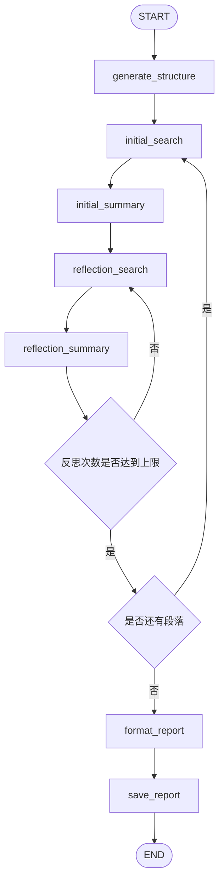
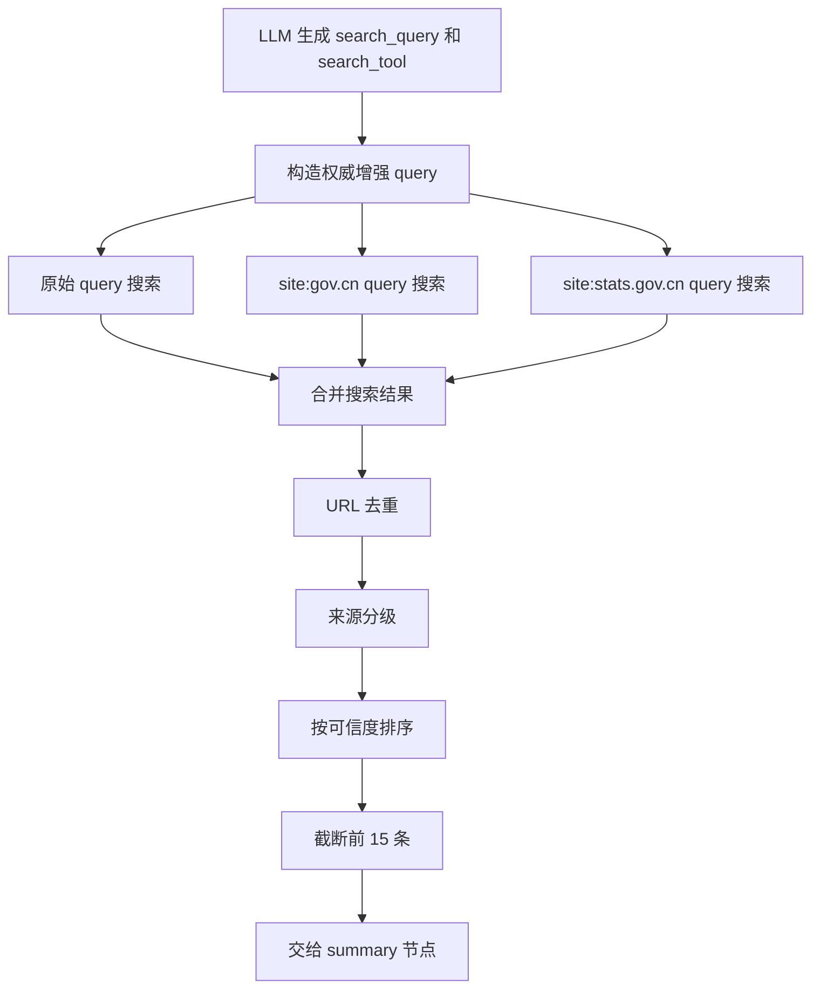
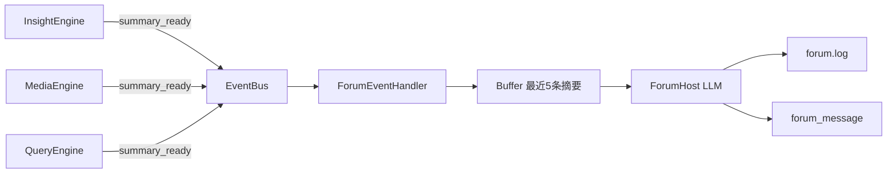
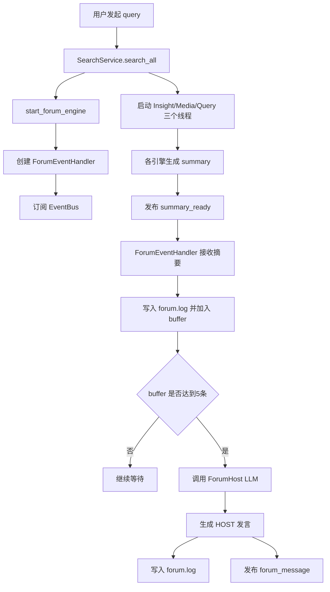
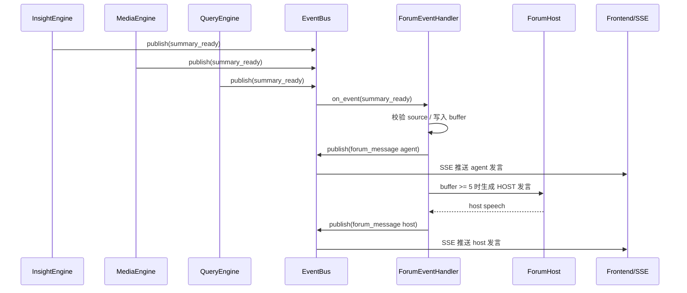
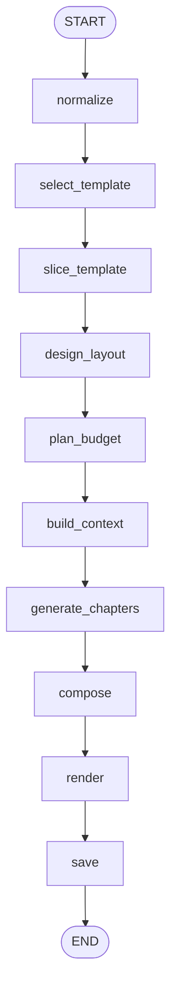
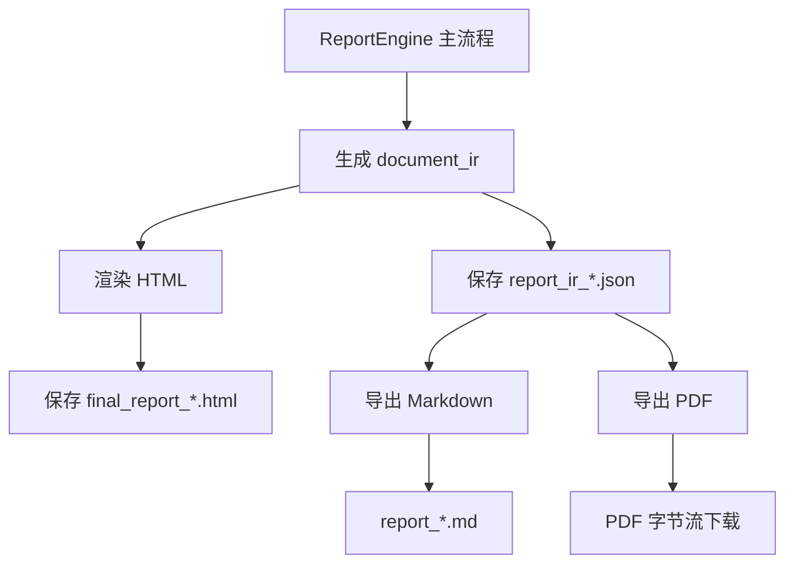
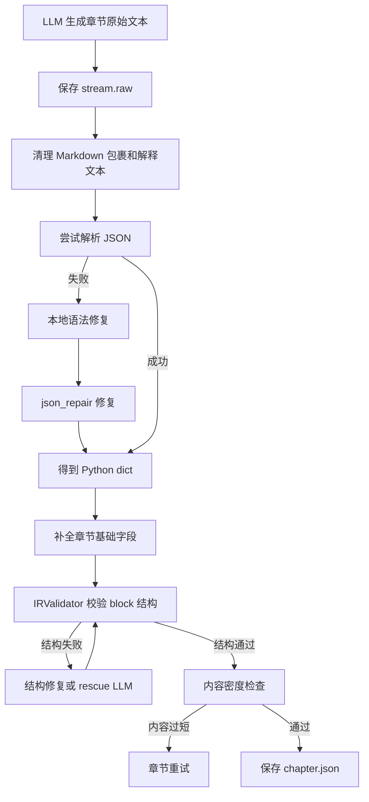
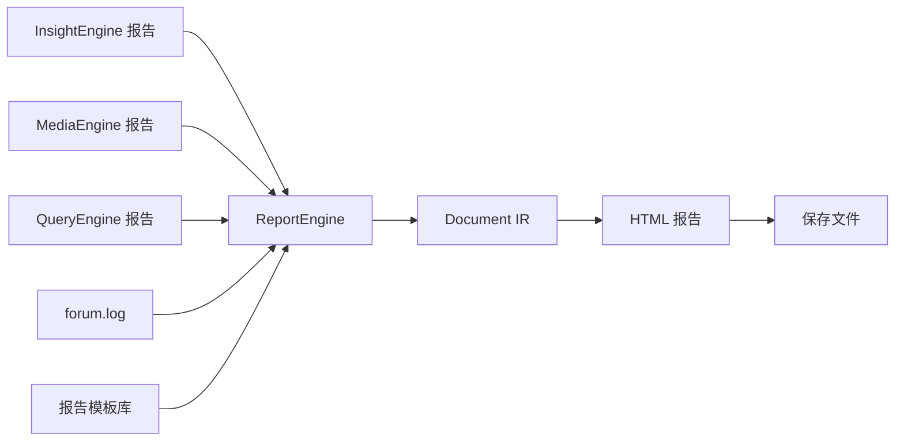

# 尚舆分析平台：MediaEngine、QueryEngine、ForumEngine和ReportEngine的构建

本文档用于指导第二阶段编码，在已经完成项目脚手架、后端 API、InsightEngine 单引擎工作流的基础上，继续实现：

- MediaEngine：网络媒体搜索与传播路径分析。
- QueryEngine：权威来源查询与事实核验。
- SearchService：从单引擎扩展为多引擎并行编排。
- ForumEngine：监听三引擎摘要，生成主持人讨论意见。

本文档是程序员编码前的设计文档，要求程序员可以直接按文档进行模块开发和验收。

---

## 01.构建MediaEngine

### 1.1 MediaEngine核心功能

MediaEngine 的定位是“媒体报道与传播路径分析引擎”。它不负责分析本地评论情绪，也不负责核验官方事实，而是通过网络搜索工具获取公开网页、新闻报道、媒体文章、图片结果和 AI 搜索摘要，分析一个事件在媒体层面的传播情况。

MediaEngine 需要回答的问题：

| 问题 | 说明 |
| --- | --- |
| 哪些媒体在报道 | 识别官方媒体、市场化媒体、自媒体、国际媒体等不同来源 |
| 媒体怎么报道 | 分析不同媒体的报道角度、标题表达、核心叙事框架 |
| 信息如何扩散 | 梳理首发来源、扩散节点、关键传播者和引爆点 |
| 报道是否存在分歧 | 对比不同媒体之间的共识、争议和信息缺口 |
| 后续传播风险是什么 | 判断话题未来几天可能继续发酵的方向 |

MediaEngine 与其他引擎的分工：

| 引擎 | 关注对象 | 数据来源 | 输出重点 |
| --- | --- | --- | --- |
| InsightEngine | 公众讨论和评论观点 | 本地舆情数据库 | 公众态度、情绪、争议点 |
| MediaEngine | 媒体报道和传播路径 | 网络搜索工具 | 媒体叙事、传播链路、报道差异 |
| QueryEngine | 权威事实和官方信息 | 权威站点、新闻搜索 | 事实核验、来源可信度、官方证据 |

### 1.2 MediaEngine提示词

MediaEngine 的提示词结构和 InsightEngine 类似，也分为：

| 阶段 | 提示词作用 | 是否调用 LLM |
| --- | --- | --- |
| `generate_structure` | 生成媒体分析报告结构 | 是 |
| `initial_search` | 根据段落目标生成搜索 query 和搜索工具 | 是 |
| `initial_summary` | 根据搜索结果生成段落初稿 | 是 |
| `reflection_search` | 根据当前段落不足生成补充搜索 query 和工具 | 是 |
| `reflection_summary` | 根据补充搜索结果更新段落内容 | 是 |
| `format_report` | 将各段落整理成最终媒体分析报告 | 是 |
| `save_report` | 保存 Markdown 报告和 state 文件 | 否 |

#### 1.2.1 generate_structure 提示词

关键代码片段：

```python
SYSTEM_PROMPT_REPORT_STRUCTURE = f"""
你是一位深度研究助手。给定一个查询，你需要规划一个报告的结构和其中包含的段落。最多5个段落。
确保段落的排序合理有序。
一旦大纲创建完成，你将获得工具来分别为每个部分搜索网络并进行反思。
...
标题和内容属性将用于更深入的研究。
确保输出是一个符合上述输出JSON模式定义的JSON对象。
只返回JSON对象，不要有解释或额外文本。
"""
```

这段提示词负责让 LLM 先规划报告段落，而不是直接开始写正文。这里的输出不是 Markdown，而是结构化 JSON，每个段落包含 `title` 和 `content`。后续节点会逐段搜索、总结、反思。

输出结构示例：

```json
[
  {
    "title": "媒体报道全景",
    "content": "分析主要媒体来源、报道数量、报道角度和核心标题"
  },
  {
    "title": "传播路径与关键节点",
    "content": "分析信息从首发到扩散的路径，以及传播引爆点"
  }
]
```

#### 1.2.2 initial_search 提示词

关键代码片段：

```python
SYSTEM_PROMPT_FIRST_SEARCH = f"""
你是一位深度研究助手。你将获得报告中的一个段落，其标题和预期内容将按照以下JSON模式定义提供：

你可以使用以下5种专业的多模态搜索工具：

1. comprehensive_search - 全面综合搜索工具
2. web_search_only - 纯网页搜索工具
3. search_for_structured_data - 结构化数据查询工具
4. search_last_24_hours - 24小时内信息搜索工具
5. search_last_week - 本周信息搜索工具

你的任务是：
1. 根据段落主题选择最合适的搜索工具
2. 制定最佳的搜索查询
3. 解释你的选择理由
"""
```

这段提示词的核心是让 LLM 做“搜索决策”，而不是让 LLM 直接写结论。LLM 需要输出：

| 字段 | 说明 |
| --- | --- |
| `search_query` | 实际要搜索的 query |
| `search_tool` | 从 5 个工具中选择一个 |
| `reasoning` | 说明为什么这样搜索 |

输出示例：

```json
{
  "search_query": "某品牌 售后争议 媒体报道 传播",
  "search_tool": "comprehensive_search",
  "reasoning": "需要同时获取网页报道、媒体摘要和可能的追问建议，用于分析整体传播情况"
}
```

#### 1.2.3 initial_summary 提示词

关键代码片段：

```python
SYSTEM_PROMPT_FIRST_SUMMARY = f"""
你是一位专业的媒体报道分析师。
...
你的核心任务：基于搜索结果撰写有信息密度的媒体传播分析段落（每段不少于800字）

撰写标准：
1. 开篇概述
2. 信息来源分析
3. 内容组织
4. 信息密度要求
5. 分析深度
6. 语言要求
"""
```

这段提示词决定了 MediaEngine 的输出风格。它要求 LLM 不只是罗列网页结果，而是分析：

| 分析维度 | 说明 |
| --- | --- |
| 来源类型 | 官方媒体、市场化媒体、自媒体、国际媒体 |
| 报道角度 | 事故问责、产业反思、监管批判、品牌回应等 |
| 叙事框架 | 不同媒体如何组织同一事件 |
| 信息缺口 | 哪些问题没有被报道清楚 |
| 共识与分歧 | 多个报道之间一致或冲突的地方 |

这里需要特别注意：MediaEngine 的总结必须基于搜索结果，不允许编造媒体名称、报道标题或具体数据。

#### 1.2.4 reflection_search 提示词

关键代码片段：

```python
SYSTEM_PROMPT_REFLECTION = f"""
你是一位深度研究助手。
...
你的任务是：
1. 反思段落文本的当前状态，思考是否遗漏了主题的某些关键方面
2. 选择最合适的搜索工具来补充缺失信息
3. 制定精确的搜索查询
4. 解释你的选择和推理
"""
```

`reflection_search` 的作用是补材料。它会读取当前段落已经写出的内容，然后判断还缺什么。例如：

| 当前缺口 | 可能选择的工具 |
| --- | --- |
| 缺少最新动态 | `search_last_24_hours` |
| 缺少一周内趋势 | `search_last_week` |
| 缺少基础报道来源 | `comprehensive_search` |
| 只需要更多网页链接 | `web_search_only` |
| 需要结构化数据 | `search_for_structured_data` |

#### 1.2.5 reflection_summary 提示词

关键代码片段：

```python
SYSTEM_PROMPT_REFLECTION_SUMMARY = f"""
你的任务是根据搜索结果和预期内容丰富段落的当前最新状态。
不要删除最新状态中的关键信息，尽量丰富它，只添加缺失的信息。
适当地组织段落结构以便纳入报告中。
"""
```

`reflection_summary` 不重新推翻段落，而是在已有段落基础上补充信息。它的重点是：

| 要求 | 说明 |
| --- | --- |
| 保留已有内容 | 不删除上一轮总结中的关键信息 |
| 增加缺失信息 | 将补充搜索结果合并进段落 |
| 优化结构 | 让段落更适合放入最终报告 |
| 避免扩写失控 | 不引入搜索结果之外的新事实 |

### 1.3 MediaEngine工作流

MediaEngine 的工作流和 InsightEngine 一样，仍然是“生成结构 -> 逐段搜索 -> 逐段总结 -> 反思补充 -> 最终格式化 -> 保存报告”。



图中描述的是 MediaEngine 的完整研究流程。流程先生成媒体分析报告结构，然后对每个段落执行一次初始搜索和初始总结。初稿生成后，系统会进入反思流程：根据当前段落内容判断是否缺少最新报道、传播路径、媒体来源或数据支撑，再进行补充搜索和段落更新。所有段落处理完成后，系统会将段落整理成完整 Markdown 报告并保存。

关键代码片段：

```python
def build_media_graph(ctx: MediaContext) -> Any:
    graph = StateGraph(MediaGraphState)

    graph.add_node("generate_structure", GenerateStructureNode(ctx))
    graph.add_node("initial_search", InitialSearchNode(ctx))
    graph.add_node("initial_summary", InitialSummaryNode(ctx))
    graph.add_node("reflection_search", ReflectionSearchNode(ctx))
    graph.add_node("reflection_summary", ReflectionSummaryNode(ctx))
    graph.add_node("format_report", FormatReportNode(ctx))
    graph.add_node("persist_report", SaveReportNode(ctx))

    graph.add_edge(START, "generate_structure")
    graph.add_edge("generate_structure", "initial_search")
    graph.add_edge("initial_search", "initial_summary")
    graph.add_edge("initial_summary", "reflection_search")
    graph.add_edge("reflection_search", "reflection_summary")
```

这段代码定义了 MediaEngine 的节点顺序。每个节点只负责一个明确动作：生成结构、搜索、总结、反思、格式化、保存。这样拆分后，每个节点都可以独立理解和替换。

反思循环的关键代码：

```python
def _should_continue_reflection(state: MediaGraphState) -> str:
    count = state.get("current_reflection_count", 0)
    max_ref = state.get("max_reflections", 2)
    return "reflect_again" if count < max_ref else "next_paragraph"
```

这段代码控制每个段落最多反思几轮。达到 `max_reflections` 后，不再继续补充搜索，而是进入下一个段落。

### 1.4 MediaEngine所使用的搜索工具

本项目支持三类搜索后端：

| 搜索后端 | 说明 | 适用场景 |
| --- | --- | --- |
| TavilySearch | 国外常见 AI 搜索 API，接口简单，适合通用网页搜索 | 默认开发和测试 |
| BochaSearch | 国内 AI 搜索服务，支持网页、图片、AI 总结、模态卡等多模态结果 | 面向国内网络环境和演示 |
| AnspireSearch | 另一类 AI 搜索服务，返回网页结果和评分 | 可作为备用搜索后端 |

搜索后端通过配置项选择：

| 配置项 | 说明 |
| --- | --- |
| `SEARCH_TOOL_TYPE=TavilyAPI` | 使用 Tavily |
| `SEARCH_TOOL_TYPE=BochaAPI` | 使用 Bocha |
| `SEARCH_TOOL_TYPE=AnspireAPI` | 使用 Anspire |

关键代码片段：

```python
if search_type == "TavilyAPI":
    search_agency = TavilySearchWrapper(api_key=config.TAVILY_API_KEY)
elif search_type == "AnspireAPI":
    search_agency = AnspireAISearch(api_key=config.ANSPIRE_API_KEY)
else:
    search_agency = BochaMultimodalSearch(api_key=config.BOCHA_WEB_SEARCH_API_KEY)
```

这段代码说明 MediaEngine 自身不关心具体使用哪个搜索厂商。外层服务根据配置创建搜索对象，然后注入给 MediaEngine。MediaEngine 内部只调用统一的工具方法。

MediaEngine 对外暴露给 LLM 的搜索工具不是 `Tavily`、`Bocha`、`Anspire` 这些厂商名称，而是下面 5 个语义化工具：

| 工具名 | 用途 | 典型场景 |
| --- | --- | --- |
| `comprehensive_search` | 综合搜索，返回网页、AI 摘要、图片、追问建议等 | 需要完整理解媒体报道全貌 |
| `web_search_only` | 只返回网页结果，不请求 AI 总结 | 只需要原始报道链接和摘要 |
| `search_for_structured_data` | 查询天气、股票、百科等结构化信息 | 需要模态卡或结构化数据 |
| `search_last_24_hours` | 搜索过去 24 小时的信息 | 突发事件、最新进展 |
| `search_last_week` | 搜索过去一周的信息 | 近期趋势、周度传播变化 |


搜索结果结构：

| 结构 | 说明 |
| --- | --- |
| `WebpageResult` | 网页搜索结果，包含标题、URL、摘要、抓取时间 |
| `ImageResult` | 图片结果，主要由 Bocha 返回 |
| `ModalCardResult` | 模态卡结构化数据，主要由 Bocha 返回 |
| `BochaResponse` | 综合响应结构，包含 answer、follow_ups、webpages、images、modal_cards |

关键代码片段：

```python
@dataclass
class WebpageResult:
    name: str
    url: str
    snippet: str
    display_url: Optional[str] = None
    date_last_crawled: Optional[str] = None

@dataclass
class BochaResponse:
    query: str
    conversation_id: Optional[str] = None
    answer: Optional[str] = None
    follow_ups: List[str] = field(default_factory=list)
    webpages: List[WebpageResult] = field(default_factory=list)
    images: List[ImageResult] = field(default_factory=list)
    modal_cards: List[ModalCardResult] = field(default_factory=list)
```


**注意**：在实际对外讲解项目时，搜索引擎建议重点讲 Bocha。Bocha 是国内专门做 AI 搜索的企业，更适合解释“AI 搜索 + 媒体传播分析”的应用场景。Tavily 是国外搜索工具，适合开发阶段作为默认通用搜索后端。另外在使用Bocha时，返回的内容可能会有图片，因此，MediaEngine还可以借助与多模态模型来增强对于外部媒体报告的理解能力。

### 1.5 MediaEngine入口函数

MediaEngine 的入口函数是 `run_research()`。它负责接收 query、配置、LLM 客户端、搜索工具和进度回调，然后构建工作流并执行。

关键代码片段：

```python
def run_research(
    query: str,
    config: Any,
    llm_client: LLMClient,
    search_agency: Any,
    progress_callback: Optional[Callable] = None,
    save_report: bool = True,
) -> Dict[str, Any]:
    ctx = MediaContext(
        llm_client=llm_client,
        config=config,
        search_agency=search_agency,
        progress_callback=progress_callback,
    )

    graph = build_media_graph(ctx)
    initial_state = {
        "query": query,
        "save_report": save_report,
        "max_reflections": config.MAX_REFLECTIONS,
    }
    result = graph.invoke(initial_state, {"recursion_limit": 100})
```

这段代码体现了 MediaEngine 的依赖注入方式：

| 参数 | 作用 |
| --- | --- |
| `query` | 用户输入的研究主题 |
| `config` | MediaEngine 配置，如模型名、输出目录、最大反思次数 |
| `llm_client` | LLM 客户端，用于结构生成、搜索决策、总结和反思 |
| `search_agency` | 搜索工具对象，可以是 Tavily、Bocha 或 Anspire |
| `progress_callback` | 进度回调，用于向前端推送引擎进度 |
| `save_report` | 是否保存 Markdown 报告和状态文件 |

返回结果：

```python
return {
    "final_report": result.get("final_report", ""),
    "report_title": result.get("report_title", ""),
    "is_completed": result.get("is_completed", False),
    "paragraphs": result.get("paragraphs", []),
}
```

MediaEngine 最终产出的是一份 Markdown 格式的媒体传播分析报告，并保留段落级状态，供后续 SearchService、ForumEngine 和 ReportEngine 继续使用。

### 1.6 边界情况

| 场景 | 处理方式 |
| --- | --- |
| 搜索工具未配置 API Key | 初始化搜索后端时抛出明确错误 |
| LLM 搜索决策失败 | 使用默认 `comprehensive_search` |
| LLM 返回未知搜索工具 | 降级为 `comprehensive_search` |
| 某个搜索后端不支持指定工具 | 调用综合搜索兜底 |
| 搜索结果为空 | 写入空结果，summary 节点只能基于有限信息生成说明性内容 |
| 搜索 API 网络异常 | 由重试机制处理，最终失败时返回空响应或抛出可见错误 |
| 报告保存失败 | 抛出异常并由上层服务发布 `engine_error` |


## 02.改造SearchService

### 2.1 目标

在加入了MediaEngine之后，需要改造searchService，从而使得在接收到query之后，InsightEngine和MediaEngine能够并行运行。具体改造方式为将InsightEngine和MediaEngine分别作为后台线程，并行执行

### 2.2 关键代码


report_service中所定义的search_all方法如下所示：
```python
def search_all(query: str):
    """启动insight engine 和 media engine"""
    if not query.strip():
        return {"success": False, "message": "搜索查询不能为空"}

    start_forum_engine()

    for engine_type in ['insight', 'media']:
        t = threading.Thread(
            target=run_engine_task,
            args=(engine_type, query),
            daemon=True,
        )
        t.start()

    return {"success": True, "message": "已启动所有引擎搜索", "query": query}
```
此时接口直接返回提交成功，后续两个引擎的进度，都能够通过SSE的方式，实时推送给前端。

在run_engine_task这个方法中，会根据传入的不同engine_type，来调用不同的research方法：
```python
def run_engine_task(engine_type: str, query: str):
    """在当前线程当中启动引擎的搜索任务, 并将进度通过SSE推送给前端"""
    _LOG_DIR.mkdir(parents=True, exist_ok=True)
    _log_file = str(_LOG_DIR / f"{engine_type}.log")
    # 按照模块名称，对不同的engine的日志，进行分流
    logger.add(
        _log_file,
        format="{time:YYYY-MM-DD HH:mm:ss} | {level} | {name} - {message}",
        level=settings.LOG_LEVEL, encoding="utf-8", rotation="10 MB",
        # record["name"] 是模块的 __name__，例如engines.InsightEngine.agent
        filter=lambda record: engine_type.lower() in record["name"].lower() or "common" in record["name"].lower(),
    )

    try:
        publish(EventType.ENGINE_PROGRESS, {
            "engine": engine_type, "status": "starting",
            "message": "正在初始化引擎...", "progress_pct": 0,
        })

        if engine_type == 'insight':
            result = _run_insight_research(query)
        elif engine_type == 'media':
            result = _run_media_research(query)
        elif engine_type == 'query':
            result = _run_query_research(query)
        else:
            raise ValueError(f"Unknown engine type: {engine_type}")

        final_report = result.get("final_report", "")
        citations = _extract_citations_from_result(result)

        publish(EventType.ENGINE_PROGRESS, {
            "engine": engine_type, "status": "finalizing",
            "message": "研究完成", "progress_pct": 100,
        })
        publish(EventType.ENGINE_RESULT, {
            "engine": engine_type, "final_report": final_report,
            "citations": citations,
        })

    except Exception as exc:
        import traceback
        logger.exception(f"{engine_type} engine error: {exc}")
        publish(EventType.ENGINE_ERROR, {
            "engine": engine_type, "error": str(exc),
            "traceback": traceback.format_exc(),
        })
```

MediaEngine的search方法为：
```python
def _run_media_research(query: str) -> Dict[str, Any]:
    from app.config import settings, Settings
    from engines.MediaEngine.agent import run_research
    from engines.MediaEngine.llms import LLMClient
    from engines.MediaEngine.tools import (
        BochaMultimodalSearch, AnspireAISearch, TavilySearchWrapper,
    )

    model = settings.MEDIA_ENGINE_MODEL_NAME or "gemini-2.5-pro"
    search_type = settings.SEARCH_TOOL_TYPE or "TavilyAPI"
    config = Settings(
        MEDIA_ENGINE_API_KEY=settings.MEDIA_ENGINE_API_KEY,
        MEDIA_ENGINE_BASE_URL=settings.MEDIA_ENGINE_BASE_URL,
        MEDIA_ENGINE_MODEL_NAME=model,
        SEARCH_TOOL_TYPE=search_type,
        TAVILY_API_KEY=settings.TAVILY_API_KEY,
        BOCHA_WEB_SEARCH_API_KEY=settings.BOCHA_WEB_SEARCH_API_KEY,
        ANSPIRE_API_KEY=settings.ANSPIRE_API_KEY,
        MAX_REFLECTIONS=2, SEARCH_CONTENT_MAX_LENGTH=20000,
        OUTPUT_DIR=OUTPUT_DIRS['media'],
    )
    llm_client = LLMClient(
        api_key=config.MEDIA_ENGINE_API_KEY,
        model_name=config.MEDIA_ENGINE_MODEL_NAME,
        base_url=config.MEDIA_ENGINE_BASE_URL,
    )

    if search_type == "TavilyAPI":
        search_agency = TavilySearchWrapper(api_key=config.TAVILY_API_KEY)
    elif search_type == "AnspireAPI":
        search_agency = AnspireAISearch(api_key=config.ANSPIRE_API_KEY)
    else:
        search_agency = BochaMultimodalSearch(api_key=config.BOCHA_WEB_SEARCH_API_KEY)

    def progress_callback(data):
        publish(EventType.ENGINE_PROGRESS, {"engine": "media", **data})

    return run_research(query, config, llm_client, search_agency, progress_callback)
```

前面的InsightEngine的search方法为：
```python
def _run_insight_research(query: str) -> Dict[str, Any]:
    from app.config import settings, Settings
    from engines.InsightEngine.agent import run_research
    from engines.InsightEngine.llms import LLMClient

    model = settings.INSIGHT_ENGINE_MODEL_NAME or "kimi-k2-0711-preview"
    config = Settings(
        INSIGHT_ENGINE_API_KEY=settings.INSIGHT_ENGINE_API_KEY,
        INSIGHT_ENGINE_BASE_URL=settings.INSIGHT_ENGINE_BASE_URL,
        INSIGHT_ENGINE_MODEL_NAME=model,
        DB_HOST=settings.DB_HOST, DB_USER=settings.DB_USER,
        DB_PASSWORD=settings.DB_PASSWORD, DB_NAME=settings.DB_NAME,
        DB_PORT=settings.DB_PORT, DB_CHARSET=settings.DB_CHARSET,
        DB_DIALECT=settings.DB_DIALECT,
        MAX_REFLECTIONS=2, MAX_CONTENT_LENGTH=500000,
        OUTPUT_DIR=OUTPUT_DIRS['insight'],
    )
    llm_client = LLMClient(
        api_key=config.INSIGHT_ENGINE_API_KEY,
        model_name=config.INSIGHT_ENGINE_MODEL_NAME,
        base_url=config.INSIGHT_ENGINE_BASE_URL,
    )

    # 这里也是一种抽象，InsightEngine当中所有的节点的事件，event_type全部都是engine_progress，
    def progress_callback(data):
        "回调函数，用以通过SSE机制，在前端展示进度"
        publish(EventType.ENGINE_PROGRESS, {"engine": "insight", **data})

    return run_research(query, config, llm_client, progress_callback)
```

## 03.构建QueryEngine

### 3.1 QueryEngine的核心功能

QueryEngine作为权威验证专家，专门用来验证官方报告、核心数据等，用以佐证整个舆情分析报告的准确性。

QueryEngine 的核心定位是“权威信息核查引擎”。它是从官方站点、权威媒体、学术研究等来源中查找可验证事实，为最终报告提供证据支撑。

QueryEngine 需要解决的问题：

| 问题 | 说明 |
| --- | --- |
| 有没有官方信息 | 查找政府公告、监管通报、官方声明、统计数据 |
| 关键数据是否可靠 | 对核心数据寻找出处、发布时间、发布机构 |
| 不同来源是否一致 | 对比官方来源、权威媒体和普通媒体的说法差异 |
| 哪些信息仍待核实 | 对缺少官方来源的信息明确标记风险 |
| 报告结论能否被支撑 | 为最终舆情报告提供可追溯的事实证据 |

QueryEngine 与 MediaEngine 的区别：

| 对比项 | MediaEngine | QueryEngine |
| --- | --- | --- |
| 关注重点 | 媒体报道和传播路径 | 权威事实和来源可信度 |
| 搜索目标 | 新闻报道、媒体文章、传播节点 | 官方公告、政策文件、权威数据、学术资料 |
| 分析方式 | 分析媒体叙事框架和传播扩散 | 进行事实核验、来源分级和证据链整理 |
| 输出风格 | 媒体传播分析报告 | 权威核查分析报告 |

### 3.2 QueryEngine提示词

QueryEngine 的提示词和 MediaEngine 结构相似，但角色完全不同。MediaEngine 的提示词要求分析“媒体怎么报道”，QueryEngine 的提示词要求核查“信息是否可靠、来源是否权威、数据是否可追溯”。

QueryEngine 的主要提示词阶段：

| 阶段 | 提示词作用 | 是否调用 LLM |
| --- | --- | --- |
| `generate_structure` | 生成权威核查报告结构 | 是 |
| `initial_search` | 根据段落目标生成权威信息搜索 query 和搜索工具 | 是 |
| `initial_summary` | 根据搜索结果生成权威核查段落初稿 | 是 |
| `reflection_search` | 判断当前段落缺少哪些官方信息或权威数据，并补充搜索 | 是 |
| `reflection_summary` | 根据补充结果更新核查段落 | 是 |
| `format_report` | 生成最终权威核查报告 | 是 |
| `save_report` | 保存 Markdown 报告和 state 文件 | 否 |

#### 3.2.1 initial_search 提示词

关键代码片段：

```python
SYSTEM_PROMPT_FIRST_SEARCH = f"""
你是一位权威信息核查专家。你将获得报告中的一个段落，其标题和预期内容将按照以下JSON模式定义提供：

你可以使用以下5种专业搜索工具，从权威渠道获取信息：

1. comprehensive_search - 综合权威信息搜索工具
2. web_search_only - 纯网页搜索工具
3. search_for_structured_data - 结构化数据查询工具
4. search_last_24_hours - 24小时最新信息搜索工具
5. search_last_week - 本周信息搜索工具

你的任务是：
1. 根据段落主题选择最合适的搜索工具
2. 制定最佳搜索查询 — 优先加入“官方”“政策”“数据”“公告”等关键词，锚定权威信源
3. 解释你的选择理由
4. 核查信息的真实性和来源权威性，甄别官方发布与媒体报道的差异
"""
```

这段提示词的重点是让 LLM 生成更偏“核查”的搜索 query。比如普通 query 可能是：

```text
某品牌售后争议
```

QueryEngine 更应该生成：

```text
某品牌售后争议 官方公告 监管通报 数据
```

或者：

```text
某行业政策 官方 文件 统计 数据
```

输出结构仍然是 `SearchOutput`：

```json
{
  "search_query": "某行业政策 官方 文件 统计 数据",
  "search_tool": "comprehensive_search",
  "reasoning": "当前段落需要查找政策原文和官方统计数据，因此优先使用综合搜索并强化官方来源关键词"
}
```

#### 3.2.2 initial_summary 提示词

关键代码片段：

```python
SYSTEM_PROMPT_FIRST_SUMMARY = f"""
你是一位权威信息核查专家和政策数据分析师。

你的核心任务：创建来源权威、数据可验证的核查分析段落（每段不少于800-1200字）

来源评级使用规则：
- official/very_high 是最高等级证据，可作为关键事实依据。
- academic/high 和 authoritative_media/high 可作为补充证据。
- media_or_unknown 不得作为关键事实的唯一依据。
- 如果某个关键事实没有 official 或 academic 来源支撑，必须明确写出“暂无官方来源验证”或“仍待官方确认”。
"""
```

这段提示词决定了 QueryEngine 的报告标准：每个结论都要尽量有来源支撑，不能把普通媒体报道当作确定事实。搜索结果中会带上来源评级，例如：

| 来源类型 | 可信度 | 使用方式 |
| --- | --- | --- |
| `official` | `very_high` | 可作为关键事实依据 |
| `academic` | `high` | 可作为研究或数据佐证 |
| `authoritative_media` | `high` | 可作为补充报道证据 |
| `media_or_unknown` | `medium` | 只能作为背景线索，不能单独支撑关键结论 |

#### 3.2.3 reflection_search 提示词

关键代码片段：

```python
SYSTEM_PROMPT_REFLECTION = f"""
你的任务是：
1. 反思段落文本的当前状态，思考是否遗漏了主题的某些关键方面
2. 选择最合适的搜索工具来补充缺失信息
3. 制定精确的搜索查询，优先加入“官方”“政策”“数据”“公告”“统计”“监管”等词
4. 优先补足官方来源、权威数据、政策原文、监管公告、学术研究等强证据
5. 解释你的选择和推理
6. 仔细核查信息中的可疑点，区分官方事实、权威媒体转述、普通媒体报道和待确认线索
"""
```

`reflection_search` 的作用是补齐证据链。比如段落初稿已经写了“事件造成较大社会影响”，但没有官方数据支撑，那么反思搜索应该补充查询：

```text
事件名称 官方 通报 影响 数据
```

如果段落中引用了媒体报道，但没有找到官方确认，则需要继续搜索：

```text
事件名称 官方回应 监管部门 公告
```

#### 3.2.4 reflection_summary 提示词

关键代码片段：

```python
SYSTEM_PROMPT_REFLECTION_SUMMARY = f"""
来源评级使用规则：
- 优先使用 official/very_high 来源修正或确认关键事实。
- academic/high 和 authoritative_media/high 可作为补充佐证。
- media_or_unknown 只能作为背景线索，不能作为关键结论的唯一依据。
- 如果新增信息缺少官方或学术来源支撑，要明确标注“待进一步核实”。
- 如不同来源冲突，优先保留官方来源，并说明冲突点。
"""
```

`reflection_summary` 的重点不是简单追加内容，而是根据新的权威信息修正段落。如果补充搜索发现官方来源和媒体报道不一致，应优先保留官方来源，并说明冲突点。

#### 3.2.5 format_report 提示词

关键代码片段：

```python
SYSTEM_PROMPT_REPORT_FORMATTING = f"""
你是一位权威信息核查专家和政策研究分析师。
你专精于从官方渠道和权威来源核实信息，产出客观严谨的数据核查报告。

你的核心使命：创建一份来源权威、数据可验证的专业核查报告，不少于一万字

来源权威性原则：
- 优先引用政府公告、官方数据、学术研究
- 严格区分官方发布与媒体报道
- 对非官方来源标注可信度等级
"""
```

最终报告强调“事实核查”和“证据链”。它不是传播分析，也不是观点分析，而是把可验证信息、权威来源、时间线、数据口径整理出来。

### 3.3 QueryEngine搜索的亮点

#### 3.3.1 搜索前，query改写优化


QueryEngine 的搜索优化不是只依赖 LLM 提示词，还会在搜索执行前对 query 做一次权威来源扩展。基本思路是：保留原始搜索 query，同时追加若干个带 `site:` 限制的查询。

关键代码片段：

```python
AUTHORITY_SEARCH_DOMAINS = (
    "gov.cn",
    "stats.gov.cn",
    "ndrc.gov.cn",
    "mof.gov.cn",
    "miit.gov.cn",
)

def build_authority_queries(query: str, max_domains: int = 2) -> list[str]:
    base = query.strip()
    if not base:
        return []

    queries = [base]
    if "site:" in base.lower():
        return queries

    for domain in AUTHORITY_SEARCH_DOMAINS[:max_domains]:
        queries.append(f"site:{domain} {base}")
    return queries
```

输入输出示例：

| 输入 query | 扩展后的查询 |
| --- | --- |
| `新能源汽车补贴政策 数据` | `新能源汽车补贴政策 数据` |
|  | `site:gov.cn 新能源汽车补贴政策 数据` |
|  | `site:gov.cn 新能源汽车补贴政策 数据` |

这样设计的好处是：既保留普通搜索的召回能力，又提高官方来源出现的概率。

#### 3.3.2 搜索后，搜索结果来源分级

搜索结果返回后，QueryEngine 会根据 URL 域名做来源分级。这一步是确定性的规则判断，不交给 LLM 自由发挥。

关键代码片段：

```python
def classify_source(url: str) -> dict[str, str]:
    host = _hostname(url)

    if any(_matches_domain(host, domain) for domain in OFFICIAL_DOMAINS):
        return {
            "source_type": "official",
            "credibility": "very_high",
            "source_label": "官方来源",
            "source_domain": host,
        }

    if any(_matches_domain(host, domain) for domain in ACADEMIC_DOMAINS):
        return {
            "source_type": "academic",
            "credibility": "high",
            "source_label": "学术/研究来源",
            "source_domain": host,
        }

    if any(_matches_domain(host, domain) for domain in AUTHORITATIVE_MEDIA_DOMAINS):
        return {
            "source_type": "authoritative_media",
            "credibility": "high",
            "source_label": "权威媒体",
            "source_domain": host,
        }

    return {
        "source_type": "media_or_unknown",
        "credibility": "medium",
        "source_label": "普通媒体或未知来源",
        "source_domain": host,
    }
```

来源分级表：

| source_type | credibility | source_label | 示例域名 |
| --- | --- | --- | --- |
| `official` | `very_high` | 官方来源 | `gov.cn`、`stats.gov.cn`、`ndrc.gov.cn` |
| `academic` | `high` | 学术/研究来源 | `edu.cn`、`ac.cn`、`cnki.net` |
| `authoritative_media` | `high` | 权威媒体 | `xinhuanet.com`、`people.com.cn`、`cctv.com` |
| `media_or_unknown` | `medium` | 普通媒体或未知来源 | 其他普通网站 |

分级后的结果示例：

```json
{
  "title": "国务院关于相关政策的通知",
  "url": "https://www.gov.cn/zhengce/example.html",
  "content": "政策文件摘要...",
  "published_date": "2026-05-19",
  "search_query_used": "site:gov.cn 某政策 官方 文件",
  "source_type": "official",
  "credibility": "very_high",
  "source_label": "官方来源",
  "source_domain": "gov.cn"
}
```


#### 3.3.3 整体搜索优化流程



图中描述的是 QueryEngine 的搜索优化流程。LLM 先生成普通搜索 query 和工具名，搜索执行时会追加官方域名限制查询。多个 query 的搜索结果合并后，系统按 URL 或标题摘要去重，然后对每条结果做来源分级，最后按照来源可信度排序，将更权威的结果排在前面。

关键代码片段：

```python
queries = build_authority_queries(search_query)
seen_urls: set[str] = set()

results: list[dict] = []
for query in queries:
    response = ctx.execute_search(search_tool, query, **kwargs)
    if not response or not response.webpages:
        continue

    for w in response.webpages:
        url = w.url or ""
        dedupe_key = url or f"{w.name}:{w.snippet}"
        if dedupe_key in seen_urls:
            continue
        seen_urls.add(dedupe_key)

        rating = classify_source(url)
        results.append({
            "title": w.name,
            "url": w.url,
            "content": w.snippet,
            "published_date": w.date_last_crawled,
            "search_query_used": query,
            **rating,
        })

results.sort(key=lambda r: (source_rank(r.get("source_type", "")), -(r.get("score") or 0)))
results = results[:15]
```

前后数据示例：

搜索前：

```json
{
  "search_query": "新能源汽车补贴政策 数据",
  "search_tool": "comprehensive_search"
}
```

搜索时实际执行：

```json
[
  "新能源汽车补贴政策 数据",
  "site:gov.cn 新能源汽车补贴政策 数据",
  "site:stats.gov.cn 新能源汽车补贴政策 数据"
]
```

搜索后：

```json
[
  {
    "title": "财政部关于新能源汽车补贴政策的通知",
    "url": "https://www.mof.gov.cn/example.html",
    "source_label": "官方来源",
    "credibility": "very_high"
  },
  {
    "title": "新华社：新能源汽车产业政策解读",
    "url": "https://www.xinhuanet.com/example.html",
    "source_label": "权威媒体",
    "credibility": "high"
  }
]
```

### 3.4 QueryEngine工作流

QueryEngine 的工作流和 MediaEngine 类似，仍然是 LangGraph 的多节点流程。区别在于：QueryEngine 的搜索节点会做权威 query 扩展和来源分级，summary 节点会根据来源可信度写出核查结论。


关键代码片段：

```python
def build_query_graph(ctx: QueryContext) -> Any:
    graph = StateGraph(QueryGraphState)
    graph.add_node("generate_structure", GenerateStructureNode(ctx))
    graph.add_node("initial_search", InitialSearchNode(ctx))
    graph.add_node("initial_summary", InitialSummaryNode(ctx))
    graph.add_node("reflection_search", ReflectionSearchNode(ctx))
    graph.add_node("reflection_summary", ReflectionSummaryNode(ctx))
    graph.add_node("format_report", FormatReportNode(ctx))
    graph.add_node("persist_report", SaveReportNode(ctx))

    graph.add_edge(START, "generate_structure")
    graph.add_edge("generate_structure", "initial_search")
    graph.add_edge("initial_search", "initial_summary")
    graph.add_edge("initial_summary", "reflection_search")
    graph.add_edge("reflection_search", "reflection_summary")
```

QueryEngine 的入口函数：

```python
def run_research(
    query: str,
    config: Any,
    llm_client: LLMClient,
    search_agency: Any,
    progress_callback: Optional[Callable] = None,
    save_report: bool = True,
) -> Dict[str, Any]:
    result = build_query_graph(ctx).invoke(
        {
            "query": query,
            "save_report": save_report,
            "max_reflections": config.MAX_REFLECTIONS,
        },
        {"recursion_limit": 100},
    )
    return {
        "final_report": result.get("final_report", ""),
        "report_title": result.get("report_title", ""),
        "is_completed": result.get("is_completed", False),
        "paragraphs": result.get("paragraphs", []),
    }
```

QueryEngine 最终产出的是 Markdown 格式的权威核查报告。这个报告会被 SearchService 作为 `query` 引擎结果返回，也会被后续 ReportEngine 读取，用于生成最终综合舆情分析报告。

### 3.5 边界情况

| 场景 | 处理方式 |
| --- | --- |
| query 为空 | 不执行搜索，返回明确错误 |
| LLM 生成未知搜索工具 | 降级为默认综合搜索 |
| 权威增强 query 没有结果 | 保留原始 query 的搜索结果 |
| 搜索结果 URL 为空 | 使用标题和摘要作为去重 key |
| 搜索结果全部来自普通媒体 | summary 中必须标注“暂无官方来源验证”或“仍待官方确认” |
| 官方来源和媒体报道冲突 | 优先保留官方来源，并说明冲突点 |
| 搜索 API 失败 | 通过重试机制处理；最终失败时返回空结果或抛出可见错误 |
| 来源域名无法识别 | 归类为 `media_or_unknown`，可信度为 `medium` |


## 04.改造SearchService

构建好了QueryEngine之后，需要改造searchService，从而使得在接收到query之后，能够进行三路并行。


_run_query_research用于启动QueryEngine的搜索Engine，QueryEngine也有单独的LLM配置

```python
def _run_query_research(query: str) -> Dict[str, Any]:
    from app.config import settings, Settings
    from engines.QueryEngine.agent import run_research
    from engines.QueryEngine.llms import LLMClient
    from engines.MediaEngine.tools.search import TavilySearchWrapper

    model = settings.QUERY_ENGINE_MODEL_NAME or "deepseek-chat"
    config = Settings(
        QUERY_ENGINE_API_KEY=settings.QUERY_ENGINE_API_KEY,
        QUERY_ENGINE_BASE_URL=settings.QUERY_ENGINE_BASE_URL,
        QUERY_ENGINE_MODEL_NAME=model,
        TAVILY_API_KEY=settings.TAVILY_API_KEY,
        MAX_REFLECTIONS=2, SEARCH_CONTENT_MAX_LENGTH=20000,
        OUTPUT_DIR=OUTPUT_DIRS['query'],
    )
    llm_client = LLMClient(
        api_key=config.QUERY_ENGINE_API_KEY,
        model_name=config.QUERY_ENGINE_MODEL_NAME,
        base_url=config.QUERY_ENGINE_BASE_URL,
    )
    search_agency = TavilySearchWrapper(api_key=config.TAVILY_API_KEY)

    def progress_callback(data):
        publish(EventType.ENGINE_PROGRESS, {"engine": "query", **data})

    return run_research(query, config, llm_client, search_agency, progress_callback)
```

## 05.添加ForumEngine


### 5.1 ForumEngine的核心功能

ForumEngine主要是用来获取Insight/Query/Media等引擎产出的summary结果，并进行整理总结，以此来模拟带主持人的论坛讨论，并最终会发表一个主持人发言，用以给到各个引擎矫正各个引擎在做段落总结时的方向

ForumEngine 的核心定位是“多引擎讨论协调器”。它的输入来自三个研究引擎已经生成的段落摘要，输出是主持人视角的综合发言。

ForumEngine 主要做四件事：

| 功能 | 说明 |
| --- | --- |
| 监听摘要 | 监听 InsightEngine、MediaEngine、QueryEngine 发布的 summary |
| 汇总上下文 | 把最近若干条 engine summary 缓存在内存中 |
| 生成主持人发言 | 当累计到 5 条消息时，调用 LLM 生成 HOST 发言 |
| 写入论坛日志 | 将各引擎摘要和 HOST 发言写入 `logs/forum.log` |

ForumEngine 在整个系统中的位置：



图中描述的是 ForumEngine 的核心机制。三个引擎在生成 `initial_summary` 或 `reflection_summary` 后，会发布 `summary_ready` 事件。ForumEventHandler 订阅这个事件，把摘要写入日志和 buffer。当 buffer 累计到 5 条时，ForumHost 调用 LLM 生成主持人发言，并继续通过事件系统发布给前端。

### 5.2 为什么需要引入ForumEngine

需要解释清楚为什么需要引入ForumEngine，如果没有ForumEngine，对于整体报告产出的影响是什么

引入 ForumEngine 的原因，是三类引擎虽然都围绕同一个 query 工作，但它们的视角不同：

| 引擎 | 视角 |
| --- | --- |
| InsightEngine | 本地舆情数据、评论观点、公众态度 |
| MediaEngine | 媒体报道、传播路径、叙事框架 |
| QueryEngine | 官方信息、权威数据、事实核查 |

如果没有 ForumEngine，三个引擎会各自独立产出段落，最终报告可能出现几个问题：

| 问题 | 影响 |
| --- | --- |
| 三个引擎互相不知道对方结论 | Insight 可能强调公众情绪，Query 可能发现官方尚未确认，两者缺少协调 |
| 报告视角容易割裂 | 媒体传播、公众情绪、官方事实之间缺少中间层整合 |
| 反思方向不够明确 | 单个引擎只能基于自己的搜索结果反思，无法看到其他引擎暴露出的矛盾 |
| 最终报告缺少讨论过程 | ReportEngine 只能读取最终报告文件，难以还原各视角之间的关系 |

ForumEngine 的价值是低成本地加入一个“弱协调层”。它不要求三个引擎每一段都同步等待，也不阻塞主流程，只是在引擎持续输出摘要时，定期生成主持人发言，帮助系统发现共识、分歧和下一步关注方向。

这种设计的重点是：ForumEngine 不是强一致协调器，而是异步讨论记录器。

### 5.3 ForumEngine的启动流程

ForumEngine并不需要单独启动，ForumEngine其实底层是通过一个ForumEventHandler实现的，当启动一个query之后，
ForumEventHandler会监控该query所对应的三个Insight/Query/Media三个引擎的initial summary, reflection summary的结果，
当积累到五条数据时，就会启动支持人，来获取最近5条发言，并调用LLM，生成一个host发言。而三个搜索的Engine，在接下来进行summary时，能够读取得到这个ForumEngine的host发言

**注意**：这里ForumEngine并不等待三个引擎各个段落的完成，而是积累到5条消息之后，就进行发言，本质上面是一种弱指导。这是一种成本低，但是收益却比较高的方式。如果需要严格地对于每一个段落，都需要综合三个engine的结果，来进行讨论，会让整个讨论的过程非常漫长

启动流程如下：



图中描述的是 ForumEngine 的启动与运行流程。用户发起 query 后，SearchService 会启动 ForumEngine，并并行启动三个研究引擎。ForumEngine 本身不主动轮询三个引擎，而是通过 EventBus 接收 `summary_ready`。只要累计到 5 条摘要，就触发 HOST 发言。

关键代码片段：

```python
def start_forum_engine():
    global _forum_handler
    if _forum_handler is not None:
        return True

    _forum_handler = ForumEventHandler()
    _forum_handler.start()
    return True
```

这段代码说明 ForumEngine 的启动入口很轻量。它只创建一个 `ForumEventHandler`，然后注册事件订阅。

ForumEventHandler 启动订阅：

```python
def start(self):
    subscribe(self.on_event)
    logger.info("ForumEngine: 事件订阅已注册，论坛会话将持续活跃")
```

这段代码说明 ForumEngine 的运行基础是 EventBus。只要 EventBus 收到事件，就会回调 `on_event()`。

处理 summary 的关键代码：

```python
def on_event(self, event_type: str, data: Dict):
    if event_type == EventType.SUMMARY_READY:
        self._handle_summary(data)
```

`summary_ready` 的来源包括三个引擎的 `initial_summary` 和 `reflection_summary`。它们发布的事件大致如下：

```python
publish(EventType.SUMMARY_READY, {
    "source": self.ctx.engine_name,
    "summary": summary,
    "type": "initial"
})
```

ForumEngine 接收后，会做来源校验：

```python
KNOWN_SOURCES = {'insight', 'media', 'query'}

source = data.get("source", "").strip().lower()
if source not in self.KNOWN_SOURCES:
    return
```

这样可以避免无关事件进入论坛讨论。

### 5.4 ForumEngine的提示词

ForumEngine 的提示词由 ForumHost 构造，目标是让 LLM 扮演“主持人”，对最近 5 条 engine summary 做综合分析。

系统提示词关键片段：

```python
def _build_system_prompt(self) -> str:
    return """
你是一个多agent尚舆分析平台的论坛主持人。你的职责是：

1. 事件梳理：从各agent的发言中自动识别关键事件、人物、时间节点，按时间顺序整理事件脉络
2. 引导讨论：根据各agent的发言，引导深入讨论关键问题，探究深层原因
3. 纠正错误：结合不同agent的视角以及言论，如果发现事实错误或逻辑矛盾，请明确指出
4. 整合观点：综合不同agent的视角，形成更全面的认识，找出共识和分歧
5. 趋势预测：基于已有信息分析舆情发展趋势，提出可能的风险点
6. 推进分析：提出新的分析角度或需要关注的问题，引导后续讨论方向
"""
```

这段提示词定义了 HOST 的角色边界。HOST 不应该重新搜索信息，也不应该创造新事实，而是基于三个引擎已有的 summary 做综合、对比和引导。

用户提示词关键片段：

```python
prompt = f"""
最近的Agent发言记录：
{speeches_text}

请你作为论坛主持人，基于以上agent的发言进行综合分析，请按以下结构组织你的发言：

一、事件梳理与时间线分析
二、观点整合与对比分析
三、深层次分析与趋势预测
四、问题引导与讨论方向
"""
```

HOST 发言结构：

| 部分 | 作用 |
| --- | --- |
| 事件梳理与时间线分析 | 把多个引擎提到的事实和节点整理成线索 |
| 观点整合与对比分析 | 对比 Insight、Media、Query 的不同视角 |
| 深层次分析与趋势预测 | 基于已有 summary 判断可能风险和趋势 |
| 问题引导与讨论方向 | 给后续分析提出需要继续关注的问题 |

ForumHost 的触发入口不是重新读取 `forum.log`，而是直接从 `ForumEventHandler.buffer` 中取最近 5 条发言。

```python
recent = self.buffer[-5:]
speech = generate_host_speech(recent)
```

这里的 `buffer` 是 ForumEngine 在接收到 `summary_ready` 事件时写入的内存列表。每次收到 Insight、Media、Query 的摘要，都会先加入 buffer：

```python
timestamp = datetime.now().strftime('%H:%M:%S')
log_line = f"[{timestamp}] [{source.upper()}] {summary}"
self.buffer.append(log_line)
```

因此，从主流程设计上看，HOST 只需要消费最近 5 条 buffer 数据即可，不需要再去读取完整日志文件。

不过当前项目中，`buffer` 里保存的是日志格式字符串，而不是结构化对象，所以 `ForumHost` 内部还会做一次轻量解析。这个解析的目的不是重新判断有哪些数据可用，而是把字符串拆成 `timestamp`、`speaker`、`content`，方便拼接 LLM prompt。

```python
match = re.match(r'\[(\d{2}:\d{2}:\d{2})\]\s*\[(\w+)\]\s*(.+)', line)
if match:
    timestamp, speaker, content = match.groups()
    if speaker in ['INSIGHT', 'MEDIA', 'QUERY']:
        parsed['agent_speeches'].append({
            'timestamp': timestamp,
            'speaker': speaker,
            'content': content
        })
```

这段代码属于格式转换层。因为传入 HOST 的最近 5 条本来就是从 `buffer[-5:]` 取出的，所以这里正常情况下只会包含三个研究引擎的发言。跳过 `SYSTEM` 和 `HOST` 是兜底保护，避免未来 buffer 数据来源变化后，主持人把系统消息或自己的发言也纳入总结。

如果从零设计这一块，更推荐把 `buffer` 直接设计成结构化对象列表，这样 `ForumHost` 就不需要再用正则解析字符串。

```python
self.buffer.append({
    "timestamp": timestamp,
    "speaker": source.upper(),
    "content": summary,
})
```

这样 HOST 生成时就可以直接使用：

```python
recent = self.buffer[-5:]
speech = generate_host_speech(recent)
```

### 5.5 ForumEngine和Insight/Query/Media引擎的通信

本项目使用EventBus进行通信

ForumEngine 与三个研究引擎之间没有直接函数调用关系。三个引擎只负责发布 `summary_ready`，ForumEngine 只负责订阅和处理该事件。



图中描述的是 ForumEngine 和三个引擎的通信方式。三个引擎并不知道 ForumEngine 的存在，只要按照约定发布 `summary_ready` 事件即可。ForumEngine 订阅 EventBus 后自动接收摘要，并继续发布 `forum_message` 给前端展示。

事件类型：

| 事件 | 发布方 | 订阅方 | 用途 |
| --- | --- | --- | --- |
| `summary_ready` | Insight/Media/Query | ForumEngine | 通知某个引擎生成了段落摘要 |
| `forum_message` | ForumEngine | 前端/SSE、内存消息列表 | 展示 agent 发言和 host 发言 |

`summary_ready` 事件示例：

```json
{
  "source": "media",
  "summary": "媒体报道主要集中在事件扩散速度、品牌回应滞后和用户投诉集中爆发三个方面。",
  "type": "initial"
}
```

`forum_message` 事件示例：

```json
{
  "type": "agent",
  "sender": "Media Engine",
  "content": "媒体报道主要集中在事件扩散速度、品牌回应滞后和用户投诉集中爆发三个方面。",
  "source": "media",
  "timestamp": "10:15:03"
}
```

HOST 发言事件示例：

```json
{
  "type": "host",
  "sender": "Forum Host",
  "content": "综合三个引擎的当前信息，公众情绪与媒体报道已经形成共振，但官方事实仍存在信息缺口...",
  "timestamp": "10:16:20"
}
```

### 5.6 ForumEngine最终的产出

ForumEngine最终产出的是一个forum.log文件，可供ReportEngine可以去读取forum.log文件

ForumEngine 的最终产出有两类：

| 产出 | 用途 |
| --- | --- |
| `forum_message` 事件 | 给前端实时展示论坛讨论过程 |
| `logs/forum.log` | 持久化记录讨论过程，供 ReportEngine 读取 |

`forum.log` 示例：

```text
[10:15:00] [SYSTEM] === ForumEngine 论坛开始 - 2026-05-19 10:15:00 ===
[10:15:08] [INSIGHT] 本地评论显示，用户主要集中质疑售后处理速度和退款进度。
[10:15:15] [MEDIA] 媒体报道集中关注事件传播速度和品牌回应滞后。
[10:15:21] [QUERY] 当前官方渠道暂未发布完整调查结论，部分信息仍需核实。
[10:15:35] [INSIGHT] 负面评论主要集中在客服响应、产品质量和平台投诉三个方面。
[10:15:42] [MEDIA] 多家媒体开始引用用户投诉案例，报道框架从个案扩展到行业服务问题。
[10:16:20] [HOST] 综合三个引擎的当前信息，公众情绪与媒体报道已经形成共振，但权威事实仍存在信息缺口...
```

写入日志的关键代码：

```python
def _write_forum_log(self, content: str, source: Optional[str] = None):
    with open(self.forum_log_file, 'a', encoding='utf-8') as f:
        ts = datetime.now().strftime('%H:%M:%S')
        line = content.replace('\n', '\\n').replace('\r', '\\r')
        tag = f" [{source}]" if source else ""
        f.write(f"[{ts}]{tag} {line}\n")
        f.flush()
```

这里会把换行符转义成 `\n`，保证 `forum.log` 每条发言占一行，便于后续解析。

### 5.7 边界情况

| 场景 | 处理方式 |
| --- | --- |
| 收到未知 source | 丢弃该事件，不写入论坛 |
| summary 为空 | 直接忽略 |
| buffer 不足 5 条 | 不触发 HOST，继续等待 |
| HOST 正在生成 | 不重复触发，避免并发生成多个主持人发言 |
| HOST LLM 调用失败 | 记录异常，不影响三个研究引擎继续运行 |
| forum.log 写入失败 | 捕获异常并记录日志，不阻塞主搜索流程 |
| 重复启动 ForumEngine | 如果 handler 已存在，直接返回成功 |


## 06.添加ReportEngine

### 6.1 ReportEngine的核心功能

本项目最终的价值，就是产出一个舆情分析报告。而这个事情，就是ReportEngine来实现的。ReportEngine本质上来讲，是一个固定流程的工作流。这个工作流将一个复杂的文件产出，拆分成一个一个的细粒度的流程

ReportEngine 的定位是“最终报告生成引擎”。前面的 InsightEngine、MediaEngine、QueryEngine 和 ForumEngine 都是在生产分析材料，而 ReportEngine 负责把这些材料组织成一份可阅读、可展示、可保存的最终舆情分析报告。

ReportEngine 的输入：

| 输入 | 来源 | 说明 |
| --- | --- | --- |
| `query` | 用户输入 | 本次报告的主题 |
| `reports` | 三个研究引擎 | Query/Media/Insight 的 Markdown 报告或结果对象 |
| `forum_logs` | ForumEngine | 多引擎讨论过程和 HOST 发言 |
| `custom_template` | 用户可选 | 用户上传或指定的报告模板 |

ReportEngine 的输出：

| 输出 | 说明 |
| --- | --- |
| `html_content` | 最终 HTML 报告内容 |
| `report_ir_*.json` | 文档 IR 中间表示 |
| `final_report_*.html` | 持久化后的 HTML 文件 |
| `report_state_*.json` | 报告任务状态文件 |

入口函数关键代码：

```python
def generate_report(
    query: str,
    reports: List[Any],
    forum_logs: str = "",
    custom_template: str = "",
    save_report: bool = True,
    stream_handler: Optional[Callable[[str, Dict[str, Any]], None]] = None,
    report_id: Optional[str] = None,
    config: Optional[Settings] = None,
) -> Dict[str, Any]:
    ...
    graph = build_report_graph(ctx)
    result = graph.invoke(initial_state, {"recursion_limit": 50})
```

这段代码说明 ReportEngine 不是单次 LLM 调用，而是一个 LangGraph 工作流。它把复杂报告拆成多个节点逐步处理，每个节点只解决一个明确问题。

### 6.2 ReportEngine的流程拆解

ReportEngine 的整体流程如下：



图中描述的是最终报告生成链路。ReportEngine 先把三引擎报告归一化，然后选择报告模板，再将模板切成章节。接着，系统会设计整份报告的标题、目录、视觉主题和篇幅规划。随后逐章生成结构化 JSON，并组合成统一的文档 IR。最后将 IR 渲染成 HTML，并保存 HTML、IR 和状态文件。

关键代码片段：

```python
def build_report_graph(ctx: ReportContext) -> Any:
    graph = StateGraph(ReportGraphState)

    graph.add_node("normalize", NormalizeReportsNode(ctx))
    graph.add_node("select_template", SelectTemplateNode(ctx))
    graph.add_node("slice_template", SliceTemplateNode(ctx))
    graph.add_node("design_layout", DesignLayoutNode(ctx))
    graph.add_node("plan_budget", PlanBudgetNode(ctx))
    graph.add_node("build_context", BuildContextNode(ctx))
    graph.add_node("generate_chapters", GenerateChaptersNode(ctx))
    graph.add_node("compose", ComposeDocumentNode(ctx))
    graph.add_node("render", RenderHtmlNode(ctx))
    graph.add_node("save", SaveReportNode(ctx))
```

各节点职责：

| 节点 | 职责 |
| --- | --- |
| `normalize` | 将三引擎输入统一成 `query_engine`、`media_engine`、`insight_engine` 三个字段 |
| `select_template` | 根据 query、三引擎报告和 forum log 选择最合适的报告模板 |
| `slice_template` | 将 Markdown 模板切分成章节结构 |
| `design_layout` | 生成报告标题、目录、Hero、主题色等全局设计 |
| `plan_budget` | 为每个章节规划字数、重点和写作约束 |
| `build_context` | 组装章节生成所需的上下文 |
| `generate_chapters` | 按章节调用 LLM 生成结构化 JSON |
| `compose` | 将章节 JSON 组合成整份文档 IR |
| `render` | 将文档 IR 渲染为 HTML |
| `save` | 保存 HTML、IR、状态文件 |

#### 6.2.1 normalize：归一化三引擎报告

ReportEngine 的输入 `reports` 是一个列表，内部需要先转成固定结构，避免后续节点不知道哪个内容来自哪个引擎。

关键代码片段：

```python
keys = ["query_engine", "media_engine", "insight_engine"]
engine_names = {
    "query_engine": "QueryEngine",
    "media_engine": "MediaEngine",
    "insight_engine": "InsightEngine",
}

for idx, key in enumerate(keys):
    value = reports[idx] if idx < len(reports) else ""
    text = _stringify(value)
    if not text or not text.strip():
        text = f"【{engine_names[key]} 未启动，本次报告无该引擎的分析数据】"
    normalized[key] = text
```

这个节点解决的是输入不稳定问题。即使某个引擎没有产出报告，ReportEngine 也不会直接失败，而是写入一个明确的占位说明。

#### 6.2.2 select_template：选择报告模板

ReportEngine 不是让 LLM 自由生成报告结构，而是从本地模板库中选择一个最合适的模板。

当前模板库包括：

| 模板 | 适用场景 |
| --- | --- |
| `企业品牌声誉分析报告模板.md` | 品牌、企业、产品声誉分析 |
| `市场竞争格局舆情分析报告模板.md` | 行业竞争、竞品、市场格局 |
| `日常或定期舆情监测报告模板.md` | 周报、月报、定期监测 |
| `特定政策或行业动态舆情分析报告模板.md` | 政策、监管、行业变化 |
| `社会公共热点事件分析报告模板.md` | 公共事件、社会热点 |
| `突发事件与危机公关舆情报告模板.md` | 危机事件、突发舆情、应急响应 |

关键代码片段：

```python
if custom_template:
    return {
        "template_result": {
            "template_name": "custom",
            "template_content": custom_template,
            "selection_reason": "用户指定的自定义模板",
        }
    }

template_input = {
    "query": query,
    "reports": reports,
    "forum_logs": forum_logs,
}
result = self.run(template_input)
```

这里有两个分支：如果用户上传了自定义模板，就直接使用；否则由 LLM 根据 query、三引擎报告和论坛日志选择一个内置模板。

#### 6.2.3 slice_template：切分模板章节

模板选定后，系统不会把整份模板一次性塞给 LLM，而是先解析成章节列表。

关键代码片段：

```python
template_content = state.get("template_result", {}).get("template_content", "")
sections = parse_template_sections(template_content)

overview = {
    "title": _extract_title(template_content, sections[0].title if sections else ""),
    "chapters": [],
}
for s in sections:
    overview["chapters"].append({
        "chapterId": s.chapter_id,
        "title": s.title,
        "rawTitle": s.raw_title,
        "number": s.number,
        "slug": s.slug,
        "order": s.order,
        "depth": s.depth,
        "outline": s.outline,
    })
```

这样做的好处是：报告可以按章节逐步生成，每个章节都有独立的编号、标题、层级和大纲。

#### 6.2.4 design_layout：设计报告整体结构和视觉主题

这一节点负责生成整份报告的全局设计，包括标题、副标题、目录计划、Hero 区域和主题色。

关键代码片段：

```python
payload = {
    "query": query,
    "template": {
        "raw": template_markdown,
        "sections": [section.to_dict() for section in sections],
    },
    "templateOverview": template_overview,
    "reports": reports,
    "forumLogs": forum_logs,
}

response = self.llm_client.stream_invoke_to_string(
    SYSTEM_PROMPT_DOCUMENT_LAYOUT,
    user_message,
    temperature=0.3,
    top_p=0.9,
)
```

这一层不是写正文，而是决定“整份报告长什么样、叫什么、目录怎么组织”。

#### 6.2.5 plan_budget：规划章节篇幅

报告不能让每个章节随意生成，否则容易出现前面章节很长、后面章节很短的问题。`plan_budget` 会为每一章规划目标字数和重点。

关键代码片段：

```python
payload = {
    "query": query,
    "design": design,
    "sections": [section.to_dict() for section in sections],
    "templateOverview": template_overview,
    "reports": reports,
    "forumLogs": forum_logs,
}

response = self.llm_client.stream_invoke_to_string(
    SYSTEM_PROMPT_WORD_BUDGET,
    user,
    temperature=0.25,
    top_p=0.85,
)
```

输出中会包含：

| 字段 | 说明 |
| --- | --- |
| `totalWords` | 整份报告目标字数 |
| `globalGuidelines` | 全局写作约束 |
| `chapters` | 每章的目标字数、重点和约束 |

#### 6.2.6 build_context：构建章节生成上下文

这一节点将模板、三引擎报告、论坛日志、主题色、篇幅规划整合成统一上下文，供后续章节生成使用。

关键代码片段：

```python
ctx = {
    "query": query,
    "template_name": template_result.get("template_name"),
    "reports": reports,
    "forum_logs": _stringify(forum_logs),
    "theme_tokens": theme,
    "style_directives": {
        "tone": "analytical",
        "audience": "executive",
        "language": "zh-CN",
    },
    "chapter_directives": chapters_map,
    "word_plan": word_plan or {},
}
```

这里的关键是把所有上游材料整合到一个稳定结构中，后面的章节生成节点不再直接读取零散文件。

#### 6.2.7 generate_chapters：逐章生成结构化 JSON

ReportEngine 不是直接让 LLM 生成 HTML，也不是直接生成 Markdown，而是要求每个章节生成符合约束的 JSON 结构。

这一节点的核心能力：

| 能力 | 说明 |
| --- | --- |
| 逐章生成 | 每个模板章节单独调用 LLM |
| 流式落盘 | 生成过程中保存 raw 输出，便于排查 |
| JSON 修复 | 对 LLM 输出的 JSON 做解析和修复 |
| IR 校验 | 使用本地校验器检查 block 类型和字段 |
| 稀疏内容重试 | 如果章节只有标题或正文过短，触发重新生成 |

关键代码片段：

```python
for idx, section in enumerate(sections):
    chap_ctx = generation_context.copy()
    logger.info(f"生成章节: {section.title}")
    self._emit(state, "chapter_status", {
        "chapterId": section.chapter_id,
        "title": section.title,
        "status": "running",
    })
```

这一节点是 ReportEngine 中最复杂的节点，因为它要应对 LLM 输出不稳定的问题。

#### 6.2.8 compose：组合文档 IR

所有章节生成完成后，需要组合成整份文档的 IR。

关键代码片段：

```python
manifest = {
    "query": query,
    "title": layout.get("title") or f"{query} - 舆情洞察报告",
    "templateName": template_result.get("template_name"),
    "toc": {
        "depth": 3,
        "autoNumbering": True,
        "title": layout.get("tocTitle") or "目录",
    },
    "hero": layout.get("hero"),
}

doc_ir = self.ctx.document_composer.build_document(report_id, manifest, chapters)
```

这里的 `document_ir` 是最终渲染的统一输入。它把标题、目录、Hero、主题色和章节内容都组织到一个结构中。

#### 6.2.9 render 与 save：渲染并保存报告

`render` 节点负责把文档 IR 渲染成 HTML。

```python
doc_ir = state.get("document_ir", {})
html = self.ctx.renderer.render(doc_ir)
return {"html_content": html}
```

`save` 节点负责保存 HTML、IR 和任务状态。

```python
html_path = Path(self.ctx.config.OUTPUT_DIR) / f"final_report_{safe}_{ts}.html"
html_path.write_text(html, encoding="utf-8")

ir_path = Path(self.ctx.config.DOCUMENT_IR_OUTPUT_DIR) / f"report_ir_{safe}_{ts}.json"
ir_path.write_text(json.dumps(doc_ir, ensure_ascii=False, indent=2), encoding="utf-8")
```

最终保存结果包括：

| 文件 | 说明 |
| --- | --- |
| `final_report_*.html` | 最终 HTML 报告 |
| `report_ir_*.json` | 文档中间表示 |
| `report_state_*.json` | 报告任务状态 |

#### 6.2.10 Markdown 与 PDF 导出：基于 IR 的二次渲染

ReportEngine 不只是可以生成 HTML。当前项目的设计是：主流程先稳定生成 HTML 和 Document IR，Markdown 与 PDF 则在任务完成后，基于已经保存的 IR 进行二次导出。



这张图表达的是：HTML 是主生成链路的直接产物；Markdown 和 PDF 不是重新跑一遍 ReportEngine，而是复用 `report_ir_*.json`。这样可以避免重复调用 LLM，也可以保证同一次任务导出的不同格式内容一致。

对应接口如下：

| 接口 | 作用 | 核心输入 | 核心输出 |
| --- | --- | --- | --- |
| `GET /api/report/download/{task_id}` | 下载 HTML 报告 | `task_id` | `final_report_*.html` |
| `GET /api/report/export/md/{task_id}` | 导出 Markdown | `task_id` 对应的 `ir_file_path` | `report_*.md` |
| `GET /api/report/export/pdf/{task_id}` | 导出 PDF | `task_id` 对应的 `ir_file_path` | PDF 字节流 |

Markdown 的生成逻辑在 `export_markdown_for_task` 中完成。它先读取任务保存的 IR，再交给 `MarkdownRenderer` 转成 Markdown 字符串，最后写入输出目录。

```python
with open(task.ir_file_path, encoding="utf-8") as f:
    document_ir = json.load(f)

md_text = MarkdownRenderer().render(document_ir, ir_file_path=task.ir_file_path)

md_path = output_dir / filename
md_path.write_text(md_text, encoding="utf-8")
```

`MarkdownRenderer` 的职责不是重新生成报告内容，而是把 Document IR 中的章节、段落、列表、表格、引用等结构转换成 Markdown。对于图表、词云、指标卡片这类不适合直接表达为纯 Markdown 的内容，它会尽量降级成表格或近似文本结构，避免关键信息丢失。

```python
class MarkdownRenderer:
    """
    将 Document IR 转为 Markdown。

    - 图表与词云统一降级为数据表格，避免丢失关键信息；
    - 尽量保留通用特性（标题、列表、代码、表格、引用等）；
    - 对不常见特性（callout/kpiGrid/engineQuote等）使用近似替换。
    """
```

PDF 的生成逻辑在 `export_pdf_for_task` 中完成。它同样先读取 IR，然后交给 `PDFRenderer` 渲染成 PDF 字节流，接口层再用 `application/pdf` 返回给前端下载。

```python
with open(task.ir_file_path, encoding="utf-8") as f:
    document_ir = json.load(f)

return PDFRenderer().render_to_bytes(document_ir, optimize_layout=optimize)
```

`PDFRenderer` 的内部流程是：先把 Document IR 渲染成适合 PDF 的 HTML，再使用 WeasyPrint 把 HTML 转成 PDF。

```python
html_content = self._get_pdf_html(document_ir, optimize_layout, ir_file_path)
font_config = FontConfiguration()
html_doc = HTML(string=html_content, base_url=str(Path.cwd()))

return html_doc.write_pdf(
    font_config=font_config,
    presentational_hints=True
)
```

这里需要注意一个边界条件：PDF 导出依赖 WeasyPrint 以及底层的 Pango/Cairo 等系统组件。接口层在导出前会先检查 Pango 是否可用，如果环境不满足，PDF 导出会失败，但 HTML 和 Markdown 不受影响。

### 6.3 ReportEngine的亮点

#### 6.3.1 使用固定模板（非LLM生成）
为了保证舆情分析平台在产出的稳定性，此处的结构，不再是让LLM去生成，而是去选择模板，也支持用户自己上传模板。

这是 ReportEngine 最重要的设计之一。最终报告的一级结构不交给 LLM 自由发挥，而是来自模板库。

这样做的好处：

| 好处 | 说明 |
| --- | --- |
| 结构稳定 | 同类报告始终遵循相似结构，便于阅读和对比 |
| 降低幻觉 | LLM 只负责选择和填充，不负责凭空设计报告体系 |
| 便于业务定制 | 不同行业、不同场景可以维护不同模板 |
| 支持用户上传 | 用户可以提供自定义模板覆盖系统模板 |

模板选择不是简单按文件名匹配，而是结合 query、三引擎报告和 forum log 判断适合哪类报告。

#### 6.3.2 生成IR中间表示（非直接生成最终HTML结构或者markdown）

ReportEngine 的另一个关键设计是：不直接让 LLM 生成最终 HTML，也不直接把 Markdown 拼起来，而是先生成 IR 中间表示。

IR 可以理解成“结构化文档对象”。它描述一份报告有哪些章节、段落、表格、引用、图表、卡片等。

IR 支持的 block 类型包括：

| block 类型 | 说明 |
| --- | --- |
| `heading` | 标题 |
| `paragraph` | 段落 |
| `list` | 列表 |
| `table` | 普通表格 |
| `swotTable` | SWOT 表 |
| `pestTable` | PEST 表 |
| `blockquote` | 引用块 |
| `engineQuote` | 引擎引用 |
| `kpiGrid` | 指标卡片 |
| `callout` | 重点提示 |
| `figure` | 图片或图形 |
| `toc` | 目录 |

关键代码片段：

```python
ALLOWED_BLOCK_TYPES = [
    "heading",
    "paragraph",
    "list",
    "table",
    "swotTable",
    "pestTable",
    "blockquote",
    "engineQuote",
    "hr",
    "code",
    "math",
    "figure",
    "callout",
    "kpiGrid",
    "widget",
    "toc",
]
```

使用 IR 的好处：

| 好处 | 说明 |
| --- | --- |
| 可校验 | LLM 输出可以先经过 schema 和 validator 检查 |
| 可修复 | JSON 结构错误时可以局部修复，而不是整份报告作废 |
| 可渲染多端 | 同一份 IR 可以渲染成 HTML、PDF 或其他格式 |
| 可追踪 | 每章生成的结构化内容可以单独保存和排查 |
| 样式可控 | 视觉样式由 renderer 控制，不由 LLM 随意写 CSS |

#### 6.3.3 章节级生成，而不是整篇一次性生成

ReportEngine 不一次性生成整篇报告，而是按模板章节逐章生成。

这样设计的原因：

| 原因 | 说明 |
| --- | --- |
| 降低上下文压力 | 每章只处理当前章节相关上下文 |
| 降低失败成本 | 某一章失败时可以只重试该章 |
| 便于质量控制 | 每章都可以独立做 JSON 校验和内容稀疏检测 |
| 便于流式反馈 | 前端可以看到章节级生成进度 |

#### 6.3.4 JSON 解析、修复与校验

这一块要先区分清楚：当前项目并不是只做了一个 `json.loads`。ReportEngine 对 LLM 生成的章节 JSON 做了三类不同事情：

| 类型 | 解决的问题 | 说明 |
| --- | --- | --- |
| JSON 语法解析与修复 | LLM 输出不是合法 JSON | 例如带 Markdown 代码块、少逗号、尾随逗号、括号不平衡 |
| IR 结构校验与修复 | JSON 合法，但不是 ReportEngine 能渲染的结构 | 例如 paragraph 字段写错、block 类型不支持、table 嵌套不符合约定 |
| 内容质量检查与重试 | JSON 合法，结构也合法，但内容太少 | 例如只有标题、正文很短、非标题 block 太少 |

也就是说，ReportEngine 关心的不是“能不能解析成 JSON”这么简单，而是要保证最终进入渲染器的是一份可渲染、可追踪、内容基本合格的章节 IR。

整体处理流程如下：



这张图表达的是：LLM 的原始输出不会直接进入 HTML 渲染。它会先被保存为 `stream.raw`，便于排查；然后经过 JSON 语法解析、IR 结构校验、内容密度检查。只有通过这些步骤的章节，才会保存为最终的 `chapter.json`，进入后续 `compose` 阶段。

第一类问题是 JSON 语法问题。LLM 经常不会只返回干净 JSON，而是返回这样的内容：

```text
```json
{
  "chapterId": "chapter_1",
  "title": "舆情概览",
  "blocks": []
}
```
```

或者出现少逗号、尾随逗号、裸换行、括号不平衡等问题。项目中使用 `RobustJSONParser` 做清理和本地修复：

```python
self._robust_parser = RobustJSONParser(
    enable_json_repair=True,
    enable_llm_repair=False,
)
```

这个解析器会先去掉 Markdown 包裹和多余说明文字，再尝试修复常见 JSON 语法问题。如果本地修复不够，还可以借助 `json_repair` 做进一步修复。

第二类问题是 IR 结构问题。JSON 能解析成功，不代表它就是 ReportEngine 可以渲染的章节结构。

例如下面这个 JSON 从语法上看是合法的：

```json
{
  "type": "paragraph",
  "text": "本章分析事件整体舆情表现。"
}
```

但它不符合本项目的 IR 约定。因为 `paragraph` 不能直接写 `text`，而应该写成 `inlines`：

```json
{
  "type": "paragraph",
  "inlines": [
    {
      "text": "本章分析事件整体舆情表现。"
    }
  ]
}
```

所以项目中使用 `IRValidator` 对章节结构做校验：

```python
valid, errors = self.validator.validate_chapter(chapter_json)
```

它会检查：

| 检查项 | 示例 |
| --- | --- |
| 章节基础字段 | `chapterId`、`title`、`anchor`、`order`、`blocks` |
| block 类型 | 是否属于 `heading`、`paragraph`、`table`、`kpiGrid` 等允许类型 |
| block 内部结构 | `paragraph` 是否有 `inlines`，`table` 是否有 `rows/cells/blocks` |
| 嵌套结构 | table、blockquote、callout 内部 block 是否仍然合法 |
| 特定字段取值 | `engineQuote.engine`、`callout.tone`、`swotTable.impact` 等是否符合约束 |

如果结构不合法，ReportEngine 会尝试做结构修复；必要时也可以调用备用 LLM 做 rescue 修复。这里的目标不是让错误静默通过，而是尽量把“可修复的结构错误”修到能渲染，把“不可修复的问题”暴露出来。

第三类问题是内容质量问题。有些章节 JSON 格式正确，结构也能通过校验，但内容本身太少。例如只生成了一个标题，或者正文只有一两句话。这种情况如果直接进入最终报告，用户看到的就是一份很空的报告。

所以 `GenerateChaptersNode` 里还会做内容密度检查：

```python
_MIN_NON_HEADING_BLOCKS = 2
_MIN_BODY_CHARACTERS = 600
_MIN_NARRATIVE_CHARACTERS = 300
```

这几个阈值表达的是：一个章节不能只有标题，也不能只有很短的正文。内容过少时，系统会触发章节重试，而不是直接接受这次输出。

总结一下ReportEngine的三道防线：

| 防线 | 目标 |
| --- | --- |
| 语法防线 | 尽量把 LLM 输出修成合法 JSON |
| 结构防线 | 保证 JSON 符合 ReportEngine IR 约定 |
| 质量防线 | 避免空章节、短章节进入最终报告 |

这部分设计的价值在于：ReportEngine 不把最终报告质量完全交给一次 LLM 输出，而是在 LLM 输出和 HTML/PDF 渲染之间增加了可检查、可修复、可重试的中间层。

### 6.4 ReportEngine 与其他模块的关系

ReportEngine 不直接启动 InsightEngine、MediaEngine、QueryEngine，也不直接监听 ForumEngine。它读取这些模块已经产出的结果，然后进行最终报告组装。



图中描述的是 ReportEngine 的输入输出关系。三引擎报告提供分析材料，ForumEngine 提供讨论过程和主持人发言，模板库提供结构约束。ReportEngine 将这些内容整合为 Document IR，再渲染成 HTML。


**注意**：ReportEngine读取三个Insight/Query/Media引擎的产出以及forum.log文件，在本项目当中是通过文件系统来实现的，在生产环境下，需要考虑将文件放到对象存储服务（OSS）中，ReportEngine来拉取这些文件。

### 6.5 边界情况

| 场景 | 处理方式 |
| --- | --- |
| 某个引擎报告缺失 | 在 `normalize` 阶段写入明确占位说明 |
| 用户上传自定义模板 | 跳过模板选择，直接使用用户模板 |
| 模板选择失败 | 使用默认模板兜底 |
| 模板无法切出章节 | 使用默认章节骨架 |
| LLM 返回 JSON 不合法 | 使用 JSON 修复器和重试机制 |
| 章节内容过短 | 判定为稀疏内容，触发重新生成 |
| IR 校验失败 | 尝试修复或重新生成对应章节 |
| HTML 渲染失败 | 抛出异常，由上层服务返回报告生成失败 |
| 保存文件失败 | 抛出异常并记录日志 |
