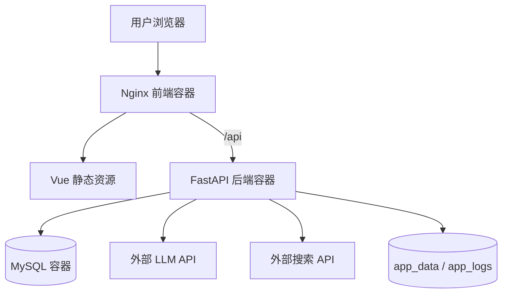
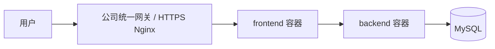
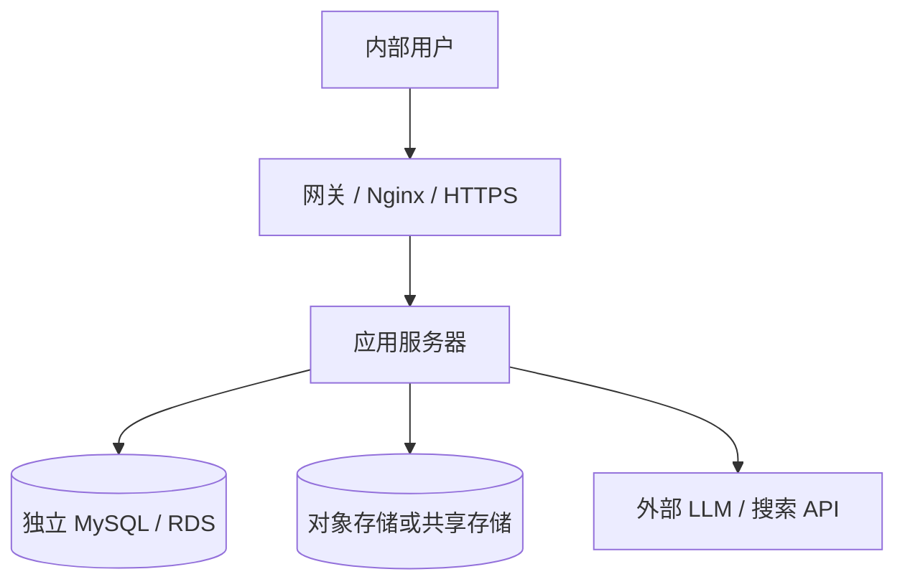

# 尚舆分析平台：Docker 部署与生产环境资源选型

本文档用于说明尚舆分析平台在生产环境下如何通过 Docker 部署，以及实际部署时需要关注哪些关键问题。

---

## 01. 当前项目的 Docker 部署结构

当前项目已经提供了 Docker 部署相关文件：

| 文件 | 作用 |
| --- | --- |
| `docker-compose.yaml` | 编排 MySQL、后端、前端三个服务 |
| `Dockerfile.backend` | 构建后端 FastAPI 镜像 |
| `Dockerfile.frontend` | 构建前端 Vue + Nginx 镜像 |
| `docker-entrypoint.sh` | 后端容器启动脚本，等待 MySQL 并初始化数据库 |
| `nginx.conf` | 前端 Nginx 配置，同时反向代理后端 API |
| `.env.example` | 环境变量示例，包括数据库、LLM、搜索工具等配置 |

整体部署结构如下：



这张图表达的是：用户访问前端 Nginx，静态页面由 Nginx 直接返回；所有 `/api` 请求转发到后端 FastAPI；后端再访问 MySQL、外部大模型 API、外部搜索 API，并把运行数据和日志写入 Docker volume。

当前 `docker-compose.yaml` 中主要包含三个服务：

| 服务 | 容器名 | 作用 | 默认端口 |
| --- | --- | --- | --- |
| `db` | `sentinelai-db` | MySQL 数据库 | `3306` |
| `backend` | `sentinelai-backend` | FastAPI 后端、各类 Engine 工作流 | `5000` |
| `frontend` | `sentinelai-frontend` | Vue 静态资源和 Nginx 反向代理 | `80` |

部署命令一般是：

```bash
cp .env.example .env
docker compose up -d --build
```

查看服务状态：

```bash
docker compose ps
docker compose logs -f backend
```

停止服务：

```bash
docker compose down
```

---

## 02. 后端容器的部署重点

后端镜像使用 Python 3.11，并采用两阶段构建：

```dockerfile
FROM docker.m.daocloud.io/library/python:3.11-slim-bookworm AS builder
...
RUN pip install --prefix=/install --no-cache-dir -r requirements.txt

FROM docker.m.daocloud.io/library/python:3.11-slim-bookworm
COPY --from=builder /install /usr/local
```

这样做的目的：

| 设计 | 说明 |
| --- | --- |
| 两阶段构建 | 构建依赖和运行环境分离，减少最终镜像体积 |
| 固定 Python 版本 | 避免不同机器 Python 版本不一致 |
| 镜像内安装依赖 | 生产环境不依赖宿主机 Python 环境 |
| 容器启动 FastAPI | 通过 uvicorn 对外提供 API 服务 |

后端启动脚本会先等待 MySQL：

```bash
until python3 -c "... pymysql.connect(...)"; do
    echo "MySQL not ready, retrying in 2s..."
    sleep 2
done
```

然后初始化数据库表：

```bash
python3 tools/SentinelSpider/schema/init_database.py
```

最后启动后端服务：

```bash
exec uvicorn app.main:app --host "${HOST:-0.0.0.0}" --port "${PORT:-5000}" --log-level info
```


---

## 03. 前端与 Nginx 的部署（了解）

前端镜像也是两阶段构建：

```dockerfile
FROM docker.m.daocloud.io/library/node:20-alpine AS builder
RUN npm ci
RUN npx vite build

FROM docker.m.daocloud.io/library/nginx:alpine
COPY --from=builder /src/dist /usr/share/nginx/html
```

构建阶段使用 Node 编译 Vue 项目，运行阶段只保留 Nginx 和静态文件。

Nginx 的核心作用有两个：

| 作用 | 说明 |
| --- | --- |
| 托管前端静态资源 | 返回 Vue 构建后的 HTML、JS、CSS |
| 反向代理后端 API | 把 `/api/` 请求转发到 `backend:5000` |

本项目里有 SSE 实时推送，所以 Nginx 代理配置里关闭了缓冲：

```nginx
location /api/ {
    proxy_pass http://backend:5000;
    proxy_buffering off;
    proxy_cache off;
    proxy_read_timeout 3600s;
    proxy_send_timeout 3600s;
}
```

这是一个很重要的面试点：如果没有关闭 `proxy_buffering`，SSE 消息可能不会实时推送，而是被 Nginx 缓冲住，前端看起来就像“没有实时输出”。


生产环境如果需要 HTTPS，一般不会直接改这个项目内置的 Nginx，而是在最外层再加公司统一的网关或 Nginx：



---

## 04. 生产环境部署注意点

### 4.1 环境变量与密钥管理

本项目依赖很多外部服务密钥，例如：

| 配置 | 作用 |
| --- | --- |
| `INSIGHT_ENGINE_API_KEY` | InsightEngine 调用大模型 |
| `MEDIA_ENGINE_API_KEY` | MediaEngine 调用大模型 |
| `QUERY_ENGINE_API_KEY` | QueryEngine 调用大模型 |
| `REPORT_ENGINE_API_KEY` | ReportEngine 调用大模型 |
| `FORUM_HOST_API_KEY` | ForumHost 调用大模型 |
| `TAVILY_API_KEY`、`ANSPIRE_API_KEY`、`BOCHA_WEB_SEARCH_API_KEY` | 网络搜索工具 |
| `DB_PASSWORD` | 数据库密码 |

生产环境注意点：

| 注意点 | 说明 |
| --- | --- |
| 不要把 `.env` 提交到 Git | `.env` 中有真实密钥 |
| 不要使用默认数据库密码 | 示例密码只能用于本地演示 |
| 区分测试和生产密钥 | 避免测试环境消耗生产额度 |
| 定期轮换密钥 | 密钥泄露后可以快速替换 |
| 控制日志输出 | 不要把 API Key 打到日志中 |

### 4.2 数据持久化

Docker 容器本身是可以删除和重建的，所以生产环境必须把关键数据放到 volume 或外部存储。

当前项目的 volume：

| volume | 挂载位置 | 用途 |
| --- | --- | --- |
| `mysql_data` | `/var/lib/mysql` | MySQL 数据 |
| `app_data` | `/app/data` | 后端生成的数据文件 |
| `app_logs` | `/app/logs` | 日志文件、forum.log 等 |

重点是：数据库不能只存在容器内部。只要容器删除，容器内部文件就可能丢失；volume 才是持久化数据的位置。

生产环境还需要考虑备份：

| 数据 | 建议 |
| --- | --- |
| MySQL | 每天定时备份，至少保留 7-30 天 |
| 报告文件 | 可以放本地 volume，也可以迁移到对象存储 |
| 日志 | 保留近期日志，长期日志进入日志平台 |

### 4.3 数据库部署方式

当前 compose 中 MySQL 是容器部署：

```yaml
db:
  image: mysql:8.0
  volumes:
    - mysql_data:/var/lib/mysql
```

对于教学、本地演示、小团队内部使用，MySQL 放在 Docker Compose 里没问题。

但实际生产环境更推荐：

| 方案 | 适用场景 | 说明 |
| --- | --- | --- |
| 独立数据库服务器 | 中型公司内部长期使用 | 便于备份、监控、扩容 |
| 云厂商 RDS | 稳定性要求更高 | 自动备份、主从、高可用更成熟 |

如果面试中被问到“生产环境数据库能不能放容器里”，可以回答：

> 可以放，但要保证 volume、备份、监控和恢复方案。更稳妥的做法是使用独立 MySQL 或云 RDS，应用容器只负责无状态计算。

### 4.4 SSE 与长连接

本项目有事件流和实时输出，例如搜索进度、Forum 消息、报告生成状态等。

这类接口一般使用 SSE 或类似长连接机制，生产环境需要注意：

| 注意点 | 说明 |
| --- | --- |
| Nginx 关闭 buffering | 否则消息不会实时到达前端 |
| 增大 read timeout | 报告生成可能持续较长时间 |
| 避免频繁重启后端 | 重启会断开 SSE 连接 |
| 多副本部署要处理会话状态 | 否则前端可能连到不同后端，拿不到同一任务状态 |

### 4.5 PDF 导出依赖

ReportEngine 支持 PDF 导出，后端镜像里安装了 Pango、Cairo 等系统依赖：

```dockerfile
RUN apt-get update && apt-get install -y --no-install-recommends \
    libpango-1.0-0 libpangocairo-1.0-0 libcairo2 ...
```

这是因为 PDF 生成不是简单写文件，而是通过 HTML 渲染成 PDF。生产环境如果 PDF 导出失败，需要优先检查：

| 检查项 | 说明 |
| --- | --- |
| WeasyPrint 是否安装 | Python 依赖是否完整 |
| Pango/Cairo 是否存在 | 系统依赖是否完整 |
| 字体是否支持中文 | 否则 PDF 中文可能乱码 |
| 容器内存是否足够 | 大报告导出 PDF 可能占用较高内存 |

### 4.6 网络访问与外部 API

这个平台不是完全离线系统。MediaEngine、QueryEngine、ForumHost、ReportEngine 等模块都可能调用外部 LLM 或搜索 API。

生产环境需要保证后端容器可以访问：

| 外部服务 | 用途 |
| --- | --- |
| 大模型 API | 生成总结、反思、报告、主持人发言 |
| 搜索 API | 获取网络媒体和权威来源信息 |
| 镜像源 / 包源 | 构建镜像时下载依赖 |

如果公司网络有限制，需要提前配置代理、白名单或私有化网关。

### 4.7 可观测性与排障

生产部署至少要能回答三个问题：

| 问题 | 需要什么 |
| --- | --- |
| 服务是否活着 | healthcheck、容器状态、接口探活 |
| 为什么失败 | 后端日志、Nginx 日志、数据库日志 |
| 资源是否够用 | CPU、内存、磁盘、网络监控 |

当前 compose 已经配置了健康检查：

```yaml
healthcheck:
  test: ["CMD", "curl", "-f", "http://localhost:5000/docs"]
```

实际生产环境建议至少监控：

| 指标 | 原因 |
| --- | --- |
| CPU 使用率 | 判断是否需要增加应用服务器资源 |
| 内存使用率 | LLM 结果处理、PDF 导出、模型推理会占内存 |
| 磁盘空间 | MySQL、日志、报告文件都会增长 |
| API 错误率 | 判断外部 LLM 或搜索服务是否不稳定 |
| 慢请求 | 报告生成、搜索链路可能耗时较长 |

---

## 05. 中型公司内部使用的资源选型

这里假设场景是：一个中型公司内部使用该平台，主要用于舆情检索、事件分析、报告生成。不是公开互联网高并发产品。

假设使用规模：

| 指标 | 估算 |
| --- | --- |
| 使用人数 | 20-100 人 |
| 同时在线 | 10-30 人 |
| 同时运行分析任务 | 3-10 个 |
| 数据量 | 百万级到千万级评论/帖子 |
| 报告生成 | 每天几十到几百份 |
| 大模型 | 主要调用外部 API，不本地部署大模型 |

### 5.1 入门生产方案：单机 Docker Compose

适合内部试运行、PoC、部门级使用。

| 资源 | 建议配置 |
| --- | --- |
| 服务器数量 | 1 台 |
| CPU | 8 核 |
| 内存 | 32 GB |
| 系统盘 | 100 GB SSD |
| 数据盘 | 500 GB - 1 TB SSD |
| 操作系统 | Ubuntu Server 22.04 / 24.04 或同类 Linux |
| 部署方式 | Docker Compose |


服务放置方式：

| 服务 | 部署位置 |
| --- | --- |
| frontend | 同一台服务器 |
| backend | 同一台服务器 |
| MySQL | 同一台服务器，使用 volume 持久化(或者独立的 MySQL 服务器/云厂商RDS) |
| 日志/报告文件 | 本机数据盘或挂载盘（或者对象存储） |


### 5.2 推荐生产方案：应用与数据库分离

适合中型公司内部长期使用。




### 5.3 高一点的内部生产方案：应用可扩展

如果公司内部使用频率更高，可以继续拆分：

| 组件 | 建议 |
| --- | --- |
| 前端 Nginx | 1-2 个实例 |
| 后端 API | 2 个实例 |
| 后台任务队列 | 独立 worker |
| Redis | 保存任务状态、SSE 消息、Forum buffer |
| MySQL/RDS | 独立部署 |
| 对象存储 | 保存报告、日志归档 |

但是当前项目如果要上这个方案，需要先做架构改造：

| 当前限制 | 改造方向 |
| --- | --- |
| 任务状态在内存中 | 迁移到 Redis 或数据库 |
| Forum 消息在内存中 | 迁移到 Redis Stream 或消息队列 |
| SSE replay buffer 在单进程内 | 迁移到 Redis Pub/Sub 或消息队列 |
| 报告文件在本地 volume | 迁移到对象存储 |
| 后端单进程 uvicorn | 改为多 worker 或拆分后台任务 worker |

所以面试中可以这样表达：

> 当前项目用 Docker Compose 可以支撑中小规模内部使用。如果要多实例扩容，关键不是简单复制后端容器，而是先把内存状态外置，比如放 Redis、数据库或消息队列。

---

## 06. 面试中可以重点说明的点

### 6.1 为什么用 Docker 部署

可以回答：

| 点 | 说明 |
| --- | --- |
| 环境一致 | Python、Node、系统依赖、PDF 依赖都封装在镜像里 |
| 启动简单 | 一条 `docker compose up -d` 启动多个服务 |
| 服务隔离 | 前端、后端、数据库互相隔离 |
| 易于迁移 | 换服务器时迁移镜像、配置和 volume 即可 |
| 便于回滚 | 可以保留旧版本镜像，发布失败时回滚 |

### 6.2 这个项目 Docker 部署的难点是什么

可以回答：

| 难点 | 说明 |
| --- | --- |
| SSE 长连接 | Nginx 要关闭 buffering，并设置较长 timeout |
| PDF 生成依赖 | WeasyPrint 依赖系统库和中文字体 |
| 数据持久化 | MySQL、报告文件、日志不能丢 |
| 多副本扩展 | 当前有内存状态，不能直接水平扩容 |

### 6.3 生产环境最重要的三件事

可以回答：

1. 配置和密钥要独立管理，不能写死在镜像里。
2. 数据库和生成文件要做持久化和备份。
3. 如果要扩容，先把任务状态、消息状态和文件存储从本机内存/本地磁盘中拆出来。

---

## 07. 总结

本项目的 Docker 部署可以分成三个层次理解：

| 层次 | 内容 |
| --- | --- |
| 基础部署 | Docker Compose 启动 MySQL、后端、前端 |
| 生产注意点 | 密钥、持久化、备份、SSE、PDF依赖、日志监控 |
| 资源选型 | 中型公司内部使用，推荐从 8C32G 起步，长期使用应用和数据库分离 |

真正面试时，不需要把每一行 Dockerfile 都背下来。更重要的是能讲清楚：这个系统有哪些服务、哪些数据必须持久化、哪些配置不能泄露、为什么 SSE 和 PDF 导出需要特殊处理，以及为什么多实例扩容前要先改造内存状态。
